# Nothing Beats Zero, and the Standard Tests Cannot Tell: Simulation Calibration of Forecast Comparison on Correlated Equity Panels

**Abstract.** Short-horizon equity forecasting papers report a model that beats a benchmark. This one reports the apparatus, calibrates it against known truth, and finds three of its standard components badly wrong. On synthetic panels whose cross-sectional correlation, volatility and predictable share are fixed by construction and matched to a real panel, the two-sided Diebold-Mariano test applied to panel rows rejects a true null 22.84% of the time on four names correlated at 0.5697 and 79.13% on a hundred, against a nominal 5%. The inflation is not a finite-sample quirk: it has the closed form 2*Phi(-z/sqrt(1+(k-1)*rho-bar)), which the simulation tracks to within 0.0064 across a size range from 0.11 to 0.79. Holm's family-wise error rate follows it to 0.5875. Against a zero-forecast benchmark the models are nested, and the squared-error comparison declares a forecast that is pure estimation noise significantly *worse* than the benchmark in 92.19% of replications in which the benchmark is exactly correct, rising to certainty as the record lengthens. The False Strategy Theorem's threshold is cleared by roughly half of all skill-free grids at every level of dependence between trials, because it is an expectation and not a critical value. Three replacements are calibrated and hold their nominal level under heavy tails, clustered volatility, regime switches and record lengths from 60 to 500 sessions: aggregating loss differentials to one value per session, the Clark-West statistic, and a stationary bootstrap that resamples an entire configuration grid on a single index draw. The corrected apparatus is then applied to a fixed four-stock Borsa Istanbul prototype universe over 251 sessions, with an executable next-open-to-close target under a date-grouped purged walk-forward protocol. No forecast shows predictive content; Hansen's test of superior predictive ability does not reject (p = 0.6891); across a 72-configuration grid whose members are measured to have a mean pairwise correlation of 0.8395 and to behave like 3.77 independent trials, the best configuration in the grid returns 4.6259% net and carries an exact joint bootstrap p-value of 0.7715; and the zero-return null has the highest out-of-sample R-squared in all 72. What does not survive is the claim that 4 of the six fitted models are significantly worse than the null, which the calibration identifies as an artefact of fitting. Inverting the corrected tests, the smallest out-of-sample R-squared this design could separate from zero at 5% size and 80% power is 0.1132 in closed form and 0.2012 by simulation, against the 0.01 this literature treats as economically meaningful; reaching 0.01 would need 15,126 sessions. Widening the cross-section cannot substitute, because the loss differentials of correlated names carry at most 1.7663 independent rows per session here, however many names are added. And a closed-form feasibility bound shows the cost schedule requires a cross-sectional information coefficient of 0.3098 from any forecaster in this design, against the 0.0092 the portfolio model achieved per session. The negative result is therefore a statement about the experiment rather than about the market. The committed run replays byte-for-byte from bundled inputs.

**Keywords:** simulation calibration, test size, forecast comparison, cross-sectional dependence, nested models, Clark-West, data snooping, superior predictive ability, deflated Sharpe ratio, effective sample size, statistical power, transaction costs, reproducible research.

> **Review response.** [`docs/review_response.md`](docs/review_response.md) records an external review of the manuscript, the three claims it falsified, what was corrected, which objections did not hold, and what remains open. Three of its seven open items are now closed — simulation-calibrated inference, nested-model tests, and joint resampling of the search — and closing them retracted a published claim. The scale limitation is not closed and is the binding one: this is a prototype and a methods note, not a benchmark.

> **Manuscript.** [`paper.pdf`](paper.pdf) is the full-length preprint: the same results with the proofs, the appendices and the executed fold table. It is regenerated from the committed run bundle by `make paper`.

> **Scope.** This is not a historical BIST-100 study. The accepted experiment is named `fixed_bist_large_cap_prototype` and contains GARAN, ISCTR, KCHOL and THYAO. [`docs/component_status.yaml`](docs/component_status.yaml) is the machine-readable boundary between what is implemented, what is integrated, and what has empirical evidence behind it.

---

## Contents

[1. Introduction](#1-introduction) · [2. Related work](#2-related-work) · [3. Data](#3-data) · [4. Method](#4-method) · [5. Calibration](#5-calibrating-the-evaluation-stack) · [6. Results](#6-results) · [7. Discussion](#7-discussion) · [8. Limitations](#8-limitations) · [9. Conclusion](#9-conclusion) · [Reproducing](#reproducing) · [Repository layout](#repository-layout) · [References](#references)

---

## 1. Introduction

A short-horizon equity forecasting result is easy to manufacture and hard to verify. The standard failure modes are well catalogued: a target the backtest could not actually have traded, a validation split that lets a model see its own future, a metric whose null is never stated, a p-value computed on rows that are not independent, and a headline drawn from whichever configuration happened to look best. Each of these inflates apparent performance without leaving an obvious trace in the code.

There is a second failure mode, and it is the subject of this work. The catalogue above assumes the tests themselves work. A p-value is a claim about a long-run frequency, and that claim is a theorem only under conditions the data are supposed to satisfy: independent observations, non-nested models, trials that disperse like independent draws. Panel forecast comparison satisfies none of them. Four tickers observed on one session are not four observations. A fitted forecast compared against a zero forecast is nested inside it. Seventy-two configurations run over overlapping folds are not seventy-two searches. Each violation is well known in isolation; what is not known is how far the resulting numbers are from the numbers they claim to be, on data with the dependence structure these studies actually have.

Section 5 measures it, by generating panels whose truth is fixed by construction and running the production estimators on them unmodified. The answers are not marginal:

| Test, as usually applied | Nominal size | Measured size |
| --- | --- | --- |
| Diebold-Mariano on panel rows, 4 correlated names | 0.05 | **0.2284** |
| Diebold-Mariano on panel rows, 100 correlated names | 0.05 | **0.7913** |
| Holm across a family of six, row level, 30 names | 0.05 | **0.5875** |
| Diebold-Mariano vs a zero benchmark, fitted noise forecast | 0.05 | **0.9219** |
| False Strategy Theorem threshold, any trial correlation | — | **cleared ~half the time** |
| *Session aggregation + Clark-West + joint bootstrap* | 0.05 | **0.0385 – 0.0565** |

This repository is built the other way around from the usual study. The question is not *can a model be found that beats the benchmark*, but *if such a model existed, would this apparatus detect it, would it say so honestly, and does it*. Six commitments follow.

**The target is executable.** The label is the return the simulated portfolio can actually earn under its own stated timing: signal after the close of session $t$, execution at the observed open of session $t+1$, exit at that session's official close. Nothing is predicted that could not have been traded.

**The evaluation respects the panel's structure.** Folds are expanding windows over unique trading dates, never row offsets, with purge and embargo. All tickers on one date stay in the same partition. Preprocessing is fitted on training rows only.

**The sample size is measured rather than assumed.** Four tickers observed on the same session are not four independent observations. Section 6.1 quantifies this and Section 4.4 states what is done about it.

**Every test states its measured size beside its nominal size.** An estimator is not trusted because it is standard. Section 5 runs each one on data whose answer is known before the estimator sees it, and reports the rate at which it is wrong with a Monte Carlo interval.

**The search is counted.** Every arbitrary choice in the design — how many training dates, how wide a validation window, how large an embargo, how many names to hold — is swept, and the reported configuration is placed inside the resulting distribution rather than presented as *the* result.

**The design is asked what it could have found.** A negative result carries information only in proportion to the power of the design that produced it. "We tested and found no effect" and "we ran a test that could not have found the effect even had it been there" are different claims, and this literature almost never distinguishes them. Section 4.8 derives three bounds — on detectable accuracy, on what breadth can buy, and on what the cost schedule demands — and Sections 6.6 to 6.8 evaluate them on the committed run.

The empirical outcome is negative. It is retained because the calibration is what makes it interpretable, and because the same calibration shows that the uncorrected apparatus would have reported a *different* negative result — one a reader could reasonably have mistaken for a finding. A negative result delivered with the machinery that would have found a positive one is a stronger statement than a positive result delivered without it; a negative result that also reports what its own instruments do when the answer is known is stronger still.

---

## 2. Related work

**Forecast comparison.** Diebold and Mariano [1] give the standard test of equal predictive accuracy between two forecasts; Harvey, Leybourne and Newbold [2] show that the statistic is oversized in small samples and supply the correction used here. Diebold [3] later cautioned that the test compares *forecasts*, not the models that produced them, which is the interpretation adopted below.

**Data snooping.** White [4] shows that selecting the best of $m$ models and testing that model alone is invalid, and gives a bootstrap Reality Check for the joint null. Hansen [5] studentizes the statistic and recentres the bootstrap, gaining power and robustness to irrelevant alternatives; Romano and Wolf [34] extend the idea to a stepwise procedure that identifies which models survive, and Hansen, Lunde and Nason [35] to a confidence set over models. Sullivan, Timmermann and White [6] apply the Reality Check to a century of technical trading rules and find that the apparent performance of the best rule largely disappears once the size of the search is accounted for. That result is the direct template for Section 6.3.

**Nested models.** When one forecast nests another, the population loss differential is zero under the null and the Diebold-Mariano numerator degenerates; Clark and McCracken [31] and McCracken [32] derive the resulting non-standard limiting distributions. Clark and West [30] give the adjustment used here, which restores approximate normality by removing the term the fitted model's own estimation variance contributes. Giacomini and White [33] instead change the null, reframing the comparison as one of conditional predictive ability. This literature is mature and unambiguous, and it is nonetheless routine for applied short-horizon studies to compare a fitted model against a zero or historical-mean forecast with an unadjusted squared-error test. Section 5.3 reports what that costs.

**Cross-sectional dependence in panels.** Petersen [36] shows that standard errors in finance panels are badly understated when a common time effect is ignored, and that the size of the error is a function of the correlation and the cross-section's width; Thompson [37] gives two-way clustered formulas. Fama and MacBeth [38] is the older remedy and the one adopted here: reduce each period's cross-section to a single number and conduct inference on the resulting series. Section 5.2 shows that applying this to loss differentials restores the nominal level of a forecast comparison exactly, and gives the closed form for the error it removes.

**Calibrating an inference procedure by simulation.** Generating data from a known truth and checking that a procedure recovers it at its advertised rate is standard in computational statistics and rare in empirical finance. Cook, Gelman and Rubin [39] formalise it for Bayesian software through the uniformity of posterior quantiles, and Talts et al. [40] generalise the construction. Section 5 is the frequentist analogue for a forecast-evaluation pipeline: the object validated is the chain of estimators that turns saved predictions into p-values, and the criterion is the measured size of each test against its nominal level.

**Dependent-data resampling.** Politis and Romano [7] introduce the stationary bootstrap, whose geometric block lengths preserve stationarity in the resampled series. Politis and White [8], corrected by Patton, Politis and White [9], give the automatic block-length rule used here, removing one arbitrary choice from the procedure.

**Backtest overfitting.** Lo [10] derives the sampling distribution of the Sharpe ratio and shows that the square-root annualisation rule is wrong under autocorrelation. Bailey and López de Prado [11] convert the Sharpe ratio into a probability that accounts for skewness and kurtosis, and [12] deflate it by the number of configurations tried, via the False Strategy Theorem. Bailey, Borwein, López de Prado and Zhu [13] show how quickly an unrecorded search produces a spurious backtest. Harvey, Liu and Zhu [14] make the same argument for the cross-section of expected returns: with hundreds of published factors, the conventional $t > 2$ hurdle is far too low.

**Costs.** Novy-Marx and Velikov [15] document that a large share of published anomalies do not survive realistic trading costs. Section 6.4 reproduces that pattern in miniature: the strategy's gross edge is real and its net edge is not.

**Effect sizes worth detecting.** Welch and Goyal [21] document that most equity-premium predictors fail out of sample; Campbell and Thompson [22] argue that an out-of-sample R-squared well under one percent is already economically meaningful, which is the scale Section 6.6 measures this design against. Gu, Kelly and Xiu [23] report values in the same range for machine-learning models on a monthly US cross-section far larger than this one. A short-horizon study claiming an R-squared an order of magnitude above that range is more likely reporting a leak than a discovery.

**Design analysis.** Cohen [24] is the standard reference for inverting a test at a stated power. Gelman and Carlin [25] argue that it should be done with a plausible effect size supplied externally rather than with the observed estimate, which is the procedure used here; Button et al. [26] and Ioannidis [27] document what happens to a field that skips it. Applying this to forecast evaluation, rather than to a clinical or psychological design, is the main methodological import of Section 4.8.

**Breadth and costs.** Grinold [28] relates the information ratio of an active strategy to skill times the square root of breadth. The feasibility bound in Section 4.8 is a cost-aware statement in the same spirit but used in the opposite direction: rather than predicting attainable performance from assumed skill, it converts an observed cost schedule into the skill a design requires, using the order-statistic machinery of David and Nagaraja [29].

**Validation for financial panels.** López de Prado [16] sets out purged and embargoed cross-validation for overlapping financial labels, which is the protocol implemented in `research/splits.py`.

**Borsa Istanbul.** Kara, Boyacıoğlu and Baykan [17] report high directional accuracy for neural networks and support vector machines on the Istanbul Stock Exchange index. That study, like most in the genre, reports directional accuracy on an index level without transaction costs, without a stated null, and without a correction for the number of specifications examined. The present work does not contradict it; it measures a different, harder quantity on a different universe, and reports what survives when those three things are supplied.

---

## 3. Data

### 3.1 Provenance

The committed run contains 1,004 provider rows for four tickers from 2025-04-07 to 2026-04-03. Every execution open and every volume observation is flagged `observed`; proxy opens are rejected outright, because a proxy open cannot be traded at.

Each record carries provider name, provider symbol, source record identifier, retrieval timestamp, and separate `open_quality` and `volume_quality` flags. The canonical record keeps four distinct price representations, which are not interchangeable:

| Representation | Research use |
|---|---|
| Raw tradable OHLCV | Orders, fills, and portfolio marking |
| Split-adjusted OHLCV | Stationary technical features where continuity is required |
| Total-return prices | Economic labels where distributions must be recognised |
| Corporate-action events | Splits, bonus issues, rights issues, cash dividends, ticker changes, delistings |

The İş Yatırım weighted-average price is represented as a proxy and is barred from next-open execution research. The raw Yahoo collector does not construct every required representation, so the committed run enters through a separately validated, provenance-bearing snapshot rather than pretending that collector output is directly accepted.

### 3.2 Calendar and corporate actions

The runner validates expected sessions, duplicates, weekend rows, holidays, timezone, and full-day and half-day open/close timestamps against the committed Borsa Istanbul schedule. The input bundle carries five sourced cash-dividend events and a per-ticker corporate-action query-coverage artifact, so "no action" is an assertion with a source rather than an absence of data.

The execution ledger credits dividends to entitled shares, adjusts quantity and basis for splits and bonus issues, remaps ticker changes, and cash-settles delistings only when a sourced settlement price exists. Rights issues fail closed without an explicit exercise policy. Because the accepted strategy holds for one session and carries no overnight entitlement, its five dividend events are persisted as `no_entitlement` rather than invented income. A synthetic two-for-one split verifies that a nominal price move from 100 to 50 does not become a false 50% economic loss.

### 3.3 Caveats

Free public sources change availability and schema without notice. Committed inputs and recursive artifact hashes isolate reproducibility from that. The universe is fixed by construction and is therefore free of survivorship bias within its own definition, but it is *not* a point-in-time index membership and no claim about BIST-100 is made anywhere in this document.

---

## 4. Method

### 4.1 Executable target

For ticker $i$ and feature date $t$, only information available after the official close of session $t$ is used. Write $O$ and $C$ for the raw tradable open and close:

$$r_{i,t+1}^{\mathrm{exec}} = \frac{C_{i,t+1}}{O_{i,t+1}} - 1, \qquad y_{i,t+1} = \mathbb{1} \lbrace r_{i,t+1}^{\mathrm{exec}} > 0 \rbrace .$$

Every panel row stores `feature_available_at`, `signal_generated_at`, `execution_timestamp`, `target_start` and `target_end`, and the chronology below is enforced as an invariant rather than assumed:

$$t_{\mathrm{feature}} < t_{\mathrm{execution}} \leq t_{\mathrm{target start}} < t_{\mathrm{target end}} .$$

This target is deliberately narrower than a generic next-day forecast. It is the return the backtest can earn under its own timing, which makes the forecasting problem harder and the backtest honest.

### 4.2 Features

The pooled model uses a typed feature manifest with a schema version, ordered names, formulas and formula versions, lookbacks, availability rules, missing-value policies, normalisation policies, and a content hash. Training and inference reject missing features, unknown features, changed ordering, and hash mismatches. Equal column count is not schema compatibility.

| Family | Features |
|---|---|
| Returns | `log_return_1d`, `log_return_5d`, `log_return_20d` |
| Trend and volatility | `close_over_sma20_minus_1`, `sma20_over_sma100_minus_1`, `atr14_over_close`, `realized_volatility_20`, `drawdown_20` |
| Intraday and volume | `vwap20_over_close_minus_1`, `log_volume`, `volume_zscore_20`, `intraday_range_over_close`, `overnight_gap` |
| Cross-sectional context | `cross_sectional_return_rank`, `market_relative_return_20d` |
| Calendar | `day_of_week_sin/cos`, `month_sin/cos` |

Raw close, moving-average levels, absolute ATR, raw VWAP, raw volume and OBV are excluded from the pooled feature set: in a pooled model, nominal price scale acts as accidental ticker identification. Missing values retain an explicit reason (`missing observation`, `insufficient lookback`, `calculation failure`, `not applicable`, `stale source`); economic zeros stay zeros.

### 4.3 Validation protocol

Folds are expanding windows over unique trading dates. A training date group is purged when any of its samples has a feature timestamp or a target end that reaches the first validation feature timestamp, so for every fold $k$:

$$\max_{j \in \mathrm{train}(k)} t^{\mathrm{target end}}_{j} < \min_{j \in \mathrm{val}(k)} t^{\mathrm{feature}}_{j} .$$

The committed run uses 24 minimum training dates, 10 validation dates, a 10-date step, a one-date embargo, and produces 12 folds. Figure 1 draws the partition that was actually executed, read from `folds.json`.

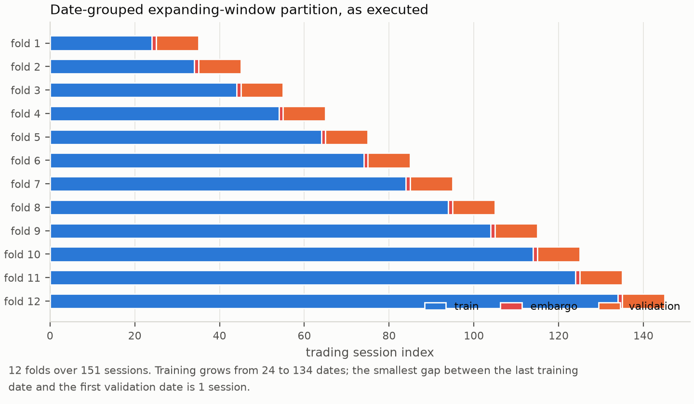

**Figure 1.** The executed date-grouped expanding-window partition. Nothing here is illustrative: each bar spans the dates the fold really used.

### 4.4 Effective sample size and the unit of inference

Four tickers observed on the same session share market-wide shocks. For $k$ units with average pairwise correlation $\bar\rho$, the variance of a cross-sectional mean is inflated by

$$\mathrm{VIF} = 1 + (k-1) \bar\rho, \qquad n_{\mathrm{eff}} = \frac{n}{\mathrm{VIF}} .$$

Rather than apply a correction factor after the fact, the evaluation changes the unit of inference: every loss differential is averaged across the tickers present on a date, and all tests are run on the resulting one-value-per-session series. The row-level statistics are computed anyway and reported alongside, so the size of the inflation is visible rather than argued about.

### 4.5 Estimators

Seven forecasters share the same panel, target, folds, feature manifest, evaluation dates and train-only preprocessing.

| Model | Role |
|---|---|
| `zero_return` | Regression null and the reference for zero-mean out-of-sample $R^2$ |
| `majority_direction` | Training-fold class-frequency null |
| `previous_return` | One-session persistence heuristic |
| `market_direction` | Same-date cross-sectional context baseline |
| `rolling_mean` | Training-history mean return |
| `logistic` | Regularised linear direction model |
| `ridge` | Regularised linear return model; also the portfolio ranking model |

The primary accuracy metric is the zero-mean out-of-sample $R^2$, which compares squared error against a zero forecast rather than against the realised sample mean:

$$R^2_{0} = 1 - \frac{\sum_{i,t} (r_{i,t} - \hat r_{i,t})^2}{\sum_{i,t} r_{i,t}^2} .$$

The sample-mean version is the wrong choice here. Its benchmark uses the mean of the evaluation window, which is not available at prediction time, so it flatters any model that merely learns the window's drift.

### 4.6 Tests

**Equal predictive accuracy.** With squared-error loss and session-aggregated differentials $d_t = L_t(\mathrm{model}) - L_t(\mathrm{null})$, the statistic is the Diebold-Mariano ratio rescaled by Harvey, Leybourne and Newbold and referred to a Student $t$ distribution on $n-1$ degrees of freedom:

$$DM = \frac{\bar d}{\sqrt{\hat\Omega / n}}, \qquad DM^{\ast} = DM \sqrt{\frac{n + 1 - 2h + h(h-1)/n}{n}} .$$

Here $\hat\Omega$ is the Bartlett long-run variance and $h = 1$ is the forecast horizon. **The sign convention matters and is reported with every test:** $d_t$ is the model's loss minus the null's loss, so a *positive* statistic means the model is worse. A table of small p-values here is a table of defeats, not of discoveries.

**Family-wise control.** Six models are tested against the same null on the same data, so the probability that at least one clears $p < 0.05$ by chance is $1 - 0.95^6 \approx 0.265$. Holm's step-down procedure [18] controls the family-wise error rate without assuming independence between the tests.

**Data snooping.** Testing the best of six models is not the same as testing six models. With relative performance $Z_{k,t} = L_t(\mathrm{null}) - L_t(\mathrm{model}\ k)$, White's Reality Check statistic and Hansen's studentized version are

$$V_n = \max_k \sqrt{n} \cdot \bar Z_k, \qquad T_n = \max \left[ 0, \max_k \frac{\sqrt{n} \cdot \bar Z_k}{\hat\omega_k} \right] .$$

Their null distributions are obtained from a stationary bootstrap that resamples every model on the same index draw, preserving cross-model dependence, with the block length chosen automatically. Hansen's three recentrings are all reported, since they bracket the p-value.

**Sharpe ratio under search.** For per-period Sharpe $\hat{SR}$ with skewness $\hat\gamma_3$ and kurtosis $\hat\gamma_4$, the probabilistic Sharpe ratio is

$$\widehat{PSR}(SR^{\ast}) = \Phi \left[ \frac{(\hat{SR} - SR^{\ast}) \sqrt{n-1}}{\sqrt{1 - \hat\gamma_3 \hat{SR} + \frac{\hat\gamma_4 - 1}{4} \hat{SR}^2}} \right] ,$$

and the deflated Sharpe ratio evaluates it at the threshold the best of $N$ skill-free trials would be expected to reach:

$$SR^{\ast}_0 = \sqrt{V[\hat{SR}]} \left[ (1 - \gamma) \Phi^{-1} \left( 1 - \tfrac{1}{N} \right) + \gamma \cdot \Phi^{-1} \left( 1 - \tfrac{1}{N e} \right) \right] ,$$

with $\gamma$ the Euler-Mascheroni constant. Both $\hat{SR}$ and $SR^{\ast}$ are per period; substituting an annualised value inflates the result silently. Lo's autocorrelation-aware annualisation factor is reported next to the square-root rule:

$$\hat\eta(q) = \frac{q}{\sqrt{q + 2 \sum_{k=1}^{m} (q-k) \hat\rho_k}} .$$

The sum runs to $q-1$ in the population, but 120 sessions cannot estimate 251 autocorrelations; lags are truncated at the Newey-West bandwidth [19, 20] and higher lags treated as zero.

### 4.7 Portfolio simulation

Long-only, top-$k$ by predicted return, equal weights, next-open execution at observed prices, one-session holding. A name is bought only when its predicted return net of the declared decision-cost assumption is positive:

$$\hat r^{\mathrm{net}}_{i,t+1} = \hat r_{i,t+1} - \widehat{\mathrm{cost}}_{i,t+1} .$$

Participation caps and market impact use a 20-session trailing volume reference whose last observation is no later than the signal date; execution-session volume is never available at the open. The ledger runs signals, orders, fills, positions, cash and costs as separate artifacts, and enforces

$$E_T = E_0 + \mathrm{PnL}_{\mathrm{gross}} + \mathrm{distributions} - \mathrm{costs} .$$

Cost sensitivity reuses the *same* trading decisions across multipliers, so only the bill moves; increasing costs cannot improve net performance, and that is asserted as an invariant.

### 4.8 What the design could detect

The tests above answer *is there evidence of skill*. They cannot answer *would they have said yes for an effect of the size anyone actually expects*. Three bounds settle that, each computed from the run's own artifacts.

**Detectable accuracy.** The Diebold-Mariano statistic is a mean over its standard error, so inverting it at size $\alpha$ and power $1-\beta$ gives the smallest mean loss differential the design could separate from zero:

$$\delta_{\min} = \left( t_{1-\alpha/2,\ n-1} + t_{1-\beta,\ n-1} \right) \cdot \mathrm{SE}(\bar d) .$$

Dividing by the null's mean squared error puts it on the scale of $R^2_0$. The bound is evaluated for the candidate with the *smallest* standard error, the one the design had the best chance of separating; quoting any other would flatter the experiment. Following Gelman and Carlin [25] the reference effect is supplied externally rather than read off the data: $R^2_0 = 0.01$, the upper end of what [22] and [23] treat as economically meaningful.

**Proposition 1 (panel information ceiling).** Let a session contain $k$ units whose targets are equicorrelated at $\bar\rho \in (0,1)$. Then it carries

$$m(k) = \frac{k}{1 + (k-1)\bar\rho}$$

independent observations, $m$ is strictly increasing in $k$, and $m(k) \uparrow 1/\bar\rho$. Widening the cross-section therefore has a hard ceiling: past a few dozen correlated names it buys essentially no precision, and only more sessions help.

**Proposition 2 (breadth-cost feasibility).** Let the forecast $\hat r$ and the realised return $r \sim \mathcal{N}(0,\sigma^2)$ be jointly normal with correlation $\rho$. A long-only rule that ranks $N$ names by $\hat r$, holds the top $k$ in equal weight for one period, and pays a round-trip cost $c$ on notional has positive expected net return only if

$$\rho > \frac{c}{\sigma \cdot \lambda(N,k)}, \qquad \lambda(N,k) = \frac{1}{k} \sum_{i=N-k+1}^{N} \mathbb{E}\left[ Z_{(i:N)} \right] .$$

Here $\lambda$ is the mean of the top-$k$ standard normal order statistics: the strength with which the rule concentrates the forecast into its right tail. **The two breadth regimes behave differently, and conflating them is an error.** At a fixed holding *fraction* $q = k/N$, $\lambda \to \varphi(\Phi^{-1}(1-q))/q$, a finite tail mean, so the requirement converges and extra names stop helping. At a fixed holding *count*, $\lambda(N,1)$ grows like $\sqrt{2 \log N}$ without bound, so the requirement falls to zero and sufficient breadth always restores feasibility in this idealised model. The bound therefore says how wide a universe a design needs, not that no universe suffices -- and in the fixed-count regime it ignores the capacity and impact constraints that bind hardest on a rule holding one name. $\rho$ is the *per-session cross-sectional* correlation, since selection happens within a session; a correlation pooled over stock-sessions also absorbs the common time-series component, which ranking cannot use. The bound is deliberately generous — it ignores estimation error in the ranking, charges the cost once per round trip, and assumes an unbiased forecast — and it is model-free, since $c$, $\sigma$ and $\lambda$ are properties of the experimental design. It can therefore be evaluated before a single model is fitted.

**Proposition 3 (effective trial count).** The False Strategy Theorem assumes the $N$ trials are independent draws. A configuration grid is not: neighbouring configurations reuse most of the same sessions and disperse less. With $V_{\mathrm{ind}} = (1 + \hat{SR}^2/2)/n$ the sampling variance of one per-period Sharpe ratio and $V_{\mathrm{real}}$ the realised variance across trials, the equation

$$\sqrt{V_{\mathrm{real}}} \cdot q(N) = \sqrt{V_{\mathrm{ind}}} \cdot q(N_{\mathrm{eff}})$$

has a unique solution, because $q$ — the bracketed factor of the deflated-Sharpe threshold — is continuous and strictly increasing. $N_{\mathrm{eff}}$ is the number of genuinely independent searches the grid behaves like, and reporting the threshold under both readings brackets the correction.

Proofs are in `src/bist_predict/research/inference/detectability.py` and in Appendix A of the manuscript; `tests/test_research/test_inference_detectability.py` pins each quantity to values computable by hand.

---

## 5. Calibrating the evaluation stack

Everything in Section 4 is standard practice. This section asks whether standard practice works, by running the same estimators on data whose answer is known before they see it. Rebuild it with `bist-predict calibrate` (about four minutes); the result is `calibration/study.json`, which carries a content hash over its own numbers.

### 5.1 The generator

A panel of $k$ units over $n$ sessions is assembled from four orthogonal unit-variance channels: a common predictable factor, a common unpredictable factor, and their idiosyncratic counterparts. With $\bar\rho$ the cross-sectional correlation, $\theta$ the predictable share of return variance, and $\nu_t$ a unit mean-square volatility path shared by every name,

$$r_{i,t} = \sigma\nu_t\left[\sqrt{\bar\rho\theta}\ z^{p}_t + \sqrt{(1-\bar\rho)\theta}\ e^{p}_{i,t} + \sqrt{\bar\rho(1-\theta)}\ z^{u}_t + \sqrt{(1-\bar\rho)(1-\theta)}\ e^{u}_{i,t}\right].$$

Pairwise correlation is then exactly $\bar\rho$ whatever the volatility path does, and the predictable component carries exactly a share $\theta$ of the variance. Building the panel from named channels rather than from a single draw is what lets a forecast be specified by its *population* moments, so a design point can be placed at a population out-of-sample $R^2$ of exactly zero rather than approximately zero.

The design point the empirical chapter is entitled to cite is fixed by measurement: four names, 120 evaluated sessions, target correlation 0.5697, target volatility 0.0190, and a forecast whose variance ratio 0.272 and cross-sectional correlation 0.947 are those of the ridge model in the committed run.

### 5.2 The size of a test applied to panel rows

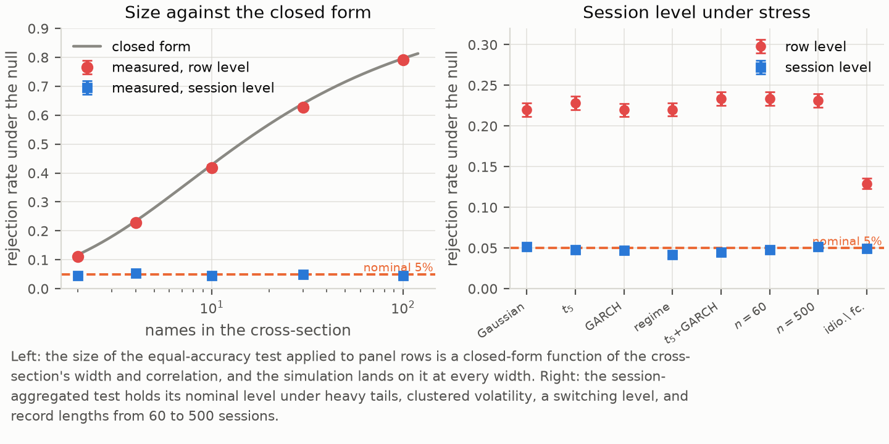

**Figure 13.** Measured size of the row-level equal-accuracy test against its closed form, and the session-aggregated test under stress.

A two-sided test at nominal level $\alpha$ that divides a pooled mean by $\sqrt{\hat\sigma^2/(kT)}$ while ignoring within-session dependence has limiting size

$$\alpha^{\*}(k,\bar\rho) = 2\Phi\left(-\frac{z_{1-\alpha/2}}{\sqrt{1+(k-1)\bar\rho}}\right).$$

| Names $k$ | Predicted (row) | Measured (row) | Measured (session) |
| ---: | ---: | ---: | ---: |
| 2 | 0.1127 | 0.1121 | 0.0459 |
| 4 | 0.2220 | 0.2284 | 0.0529 |
| 10 | 0.4128 | 0.4185 | 0.0461 |
| 30 | 0.6270 | 0.6281 | 0.0492 |
| 100 | 0.7878 | 0.7913 | 0.0456 |

The largest discrepancy anywhere in the sweep is 0.0064, the order of the Monte Carlo error at ten thousand replications. The formula is therefore not an approximation to be checked but a description to be used: a study pooling twenty names correlated at 0.4 is running a 57% test and calling it a 5% test.

Two things the table settles. The failure is not a small-sample effect — the row-level size is 0.2314 over 500 sessions against 0.2339 over 60, because lengthening the record does not make rows within a session less dependent. And it is not confined to wide panels — even two names inflate a 5% test to 11%.

Aggregating to one differential per session removes the error completely, and keeps it removed under Student $t_5$ innovations, GARCH volatility, a switching level, both together, and record lengths from 60 to 500 sessions, where it stays inside [0.0419, 0.0519]. This is the Fama-MacBeth construction applied to loss differentials rather than to returns.

### 5.3 What a squared-error comparison does to a nested model

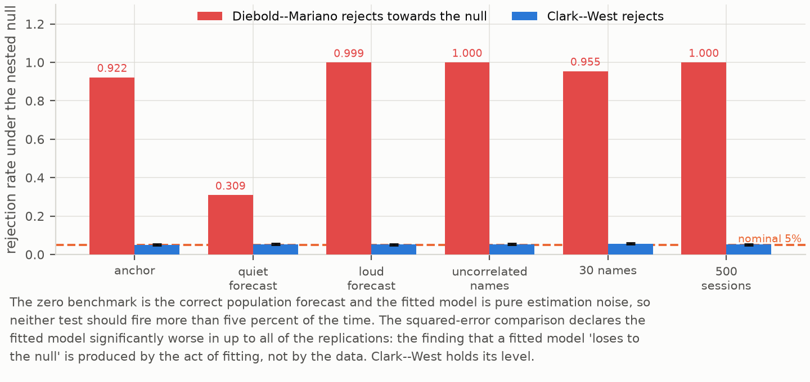

**Figure 14.** Under the nested null the benchmark is correct and the fitted model is noise. The squared-error comparison convicts it anyway.

Comparing a fitted forecast against a zero forecast asks a question the fitted model cannot win fairly. With $d_t = \hat r_t^2 - 2 r_t \hat r_t$,

$$\mathbb{E}[d] = \mathbb{E}[\hat r^2] - 2\ \mathrm{cov}(r,\hat r),$$

so a forecast carrying genuine but small covariance still loses whenever its estimation variance exceeds twice that covariance. Under the null that the *population* forecast is zero, the fitted forecast is not zero — it is noise, with a variance the estimation procedure put there.

| Design | Forecast variance ratio | DM rejects towards null | Clark-West |
| --- | ---: | ---: | ---: |
| Anchor design | 0.272 | 0.9219 | 0.0508 |
| Low-variance forecast | 0.050 | 0.3091 | 0.0534 |
| High-variance forecast | 0.600 | 0.9988 | 0.0513 |
| Uncorrelated names | 0.272 | 1.0000 | 0.0532 |
| 30 names | 0.272 | 0.9545 | 0.0565 |
| 500 sessions | 0.272 | 1.0000 | 0.0521 |

More data makes the error more certain, not less, because the bias is in the estimand and not in the standard error. The consequence is direct and it applies to this repository's own earlier reporting: a study that compares fitted models against a zero or historical-mean benchmark under squared-error loss and reports several of them "significantly worse than the benchmark" has, with high probability, reported the output of the identity above rather than a fact about its data.

Clark and West remove the offending term. Adding back $(\hat r_t - 0)^2$ gives $f_t = 2 r_t \hat r_t$, whose expectation is zero under the null and positive whenever the forecast covaries with the target. The resulting one-sided test is correctly sized at every cell above.

### 5.4 Family-wise error and the multiple-comparison layer

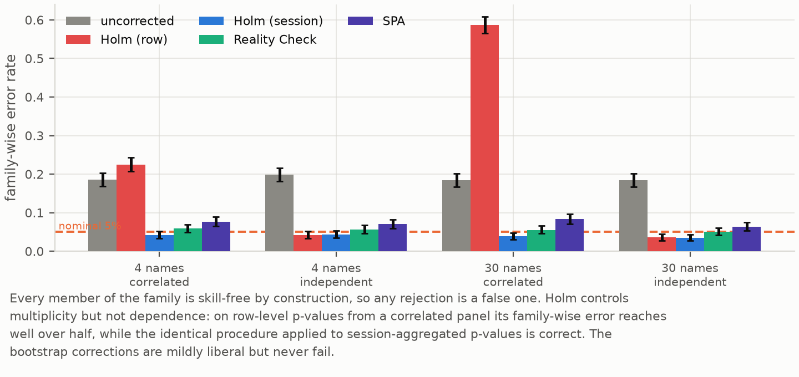

**Figure 15.** Family-wise error with every family member skill-free by construction.

| Correction | $k{=}4$ corr. | $k{=}4$ indep. | $k{=}30$ corr. | $k{=}30$ indep. |
| --- | ---: | ---: | ---: | ---: |
| Uncorrected | 0.186 | 0.198 | 0.185 | 0.185 |
| Holm, row level | 0.225 | 0.042 | 0.588 | 0.036 |
| Holm, session level | 0.042 | 0.043 | 0.039 | 0.035 |
| White Reality Check | 0.059 | 0.057 | 0.056 | 0.051 |
| SPA, untruncated | 0.076 | 0.070 | 0.082 | 0.063 |
| SPA, Hansen | 0.077 | 0.070 | 0.083 | 0.064 |

Holm controls the family but not the dependence: it cannot repair p-values that were wrong before it saw them. The correction is not the problem; its inputs are. The bootstrap corrections behave well without the aggregation, because the stationary bootstrap resamples sessions and carries the within-session dependence with them — but a nominal 5% SPA test on a design like this one is closer to an 8% test, which is worth stating rather than burying.

The two SPA variants are indistinguishable (0.0755 against Hansen's 0.0765), which settles a deviation this repository had previously flagged as unvalidated.

### 5.5 What a correlated search is worth

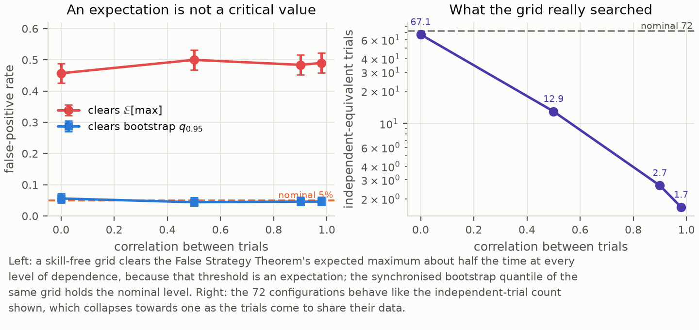

**Figure 16.** The False Strategy expectation is not a critical value; the joint bootstrap is.

| Trial correlation | Clears $\mathbb{E}[\max]$ | Clears bootstrap $q_{0.95}$ | $N_{\mathrm{eff}}$ |
| ---: | ---: | ---: | ---: |
| 0.00 | 0.457 | 0.056 | 67.10 |
| 0.50 | 0.500 | 0.044 | 12.95 |
| 0.90 | 0.484 | 0.046 | 2.66 |
| 0.98 | 0.490 | 0.046 | 1.67 |

A skill-free grid of 72 configurations clears the False Strategy Theorem's expected maximum about half the time at every level of dependence. The rate is flat in the dependence, which is the signature of a definitional error rather than of a dependence problem: an expectation is cleared about half the time whatever the correlation. Reporting a grid maximum below this threshold is a weak statement; reporting one above it is not evidence of anything.

Resampling the whole grid on a single stationary-bootstrap index draw fixes it. The draw preserves both the serial dependence within a configuration and the cross-sectional dependence between configurations, and its 95th percentile is a critical value rather than a mean. Its size is correct at every level, including at $\bar\rho = 0.98$ where the analytic correction has no purchase at all. The same construction recovers 67.10 of a nominal 72 when the trials genuinely are independent, which is the check that licenses reading the smaller numbers.

### 5.6 What is and is not established here

The calibration is a statement about estimators applied to data with a stated dependence structure, not about markets. Its force comes from the structure being measured from a real panel rather than chosen for convenience, and from the estimators being the production ones: the fast path used to form loss differentials is checked against the pandas path the empirical chapter runs, to floating-point tolerance, by a test that fails if they diverge.

Three limits. The generator is equicorrelated, so it does not reproduce a factor structure with heterogeneous loadings. Forecast families are generated by adding independent noise to a shared predictable component. And the search experiment imposes exchangeable correlation between trials, whereas a real grid has neighbours more alike than distant points. In every case the approximation runs towards understating the problem, so the measured error rates are lower bounds. A study whose design point differs must re-run the calibration at its own, which is why the generator and the study driver are part of the released code rather than a description in prose.

---

## 6. Results

### 6.1 The panel carries fewer observations than it has rows

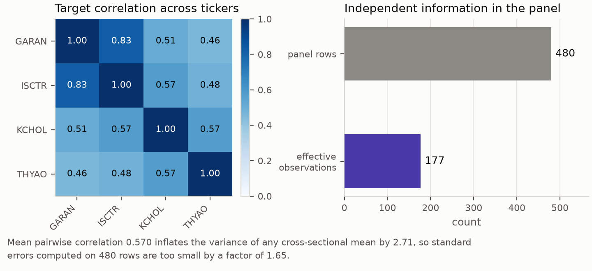

**Figure 2.** Realised correlation of the executable target across the four tickers, and the sample size it implies.

The four tickers correlate at 0.570 on average within a session, ranging from 0.46 (GARAN-THYAO) to 0.83 (GARAN-ISCTR) — two large banks moving together, as expected. The 480 out-of-sample rows spread over 120 evaluation sessions therefore carry about 177 independent observations. Standard errors computed as though the rows were independent are too small by a factor of 1.65, and p-values are correspondingly too small. Section 6.2 shows what that does in practice.

### 6.2 No fitted model carries predictive content

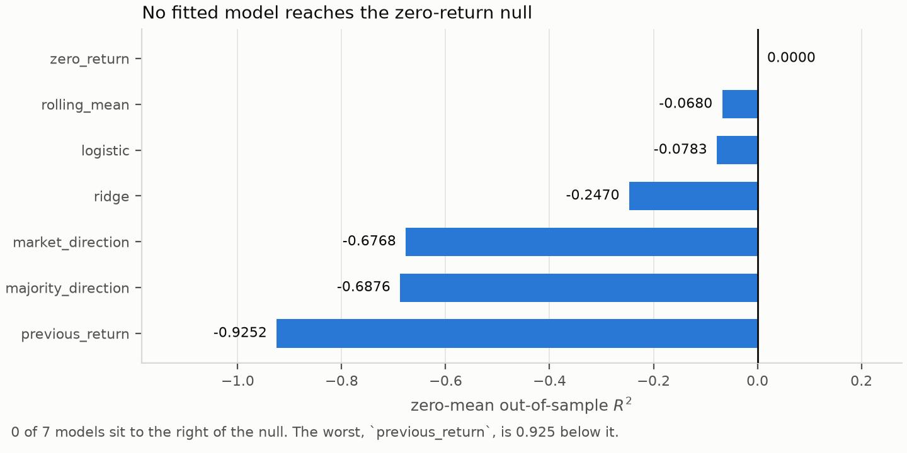

**Figure 3.** Zero-mean out-of-sample $R^2$ by model. The null is exactly zero by construction.

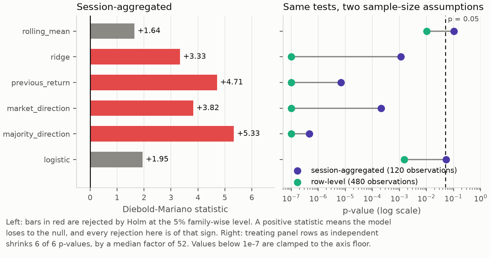

**Figure 4.** Diebold-Mariano statistics against the zero-return null, and the same tests under two sample-size assumptions.

Every fitted model has negative out-of-sample $R^2$. Under Holm correction, 4 of the six fitted models are significantly worse than the null and 0 are significantly better; `logistic` and `rolling_mean` are indistinguishable from it.

**That last sentence is the one Section 5.3 forces us to unlearn, and the correction is stated plainly here because the reading it displaces is the natural one and this repository had adopted it.** The natural reading — several models are reliably *worse* than predicting zero, which is what fitting to a signal-free panel produces — treats the four rejections as information. They are not. At this exact forecast variance ratio, the comparison produces significant rejections towards the benchmark in 92.19% of replications in which the benchmark is exactly correct. Four of six is not evidence that the models are bad; it is slightly fewer rejections than the null itself predicts. The correct statement is that the equal-accuracy table carries no information about these models in either direction.

The question the apparatus should have been asked is whether the forecasts carry predictive content at all. Clark-West answers it with the statistic that is correctly sized for this nested pair, and no model reaches significance:

| Model | $CW$ | one-sided $p$ | Verdict |
| --- | ---: | ---: | --- |
| `ridge` | +0.621 | 0.2672 | none |
| `previous_return` | +0.596 | 0.2757 | none |
| `majority_direction` | +0.366 | 0.3572 | none |
| `logistic` | +0.268 | 0.3944 | none |
| `market_direction` | +0.077 | 0.4695 | none |
| `rolling_mean` | −0.229 | 0.5904 | none |

Holm rejects nothing. The ordering is worth noting because it inverts the squared-error ordering: `ridge` and `previous_return`, two of the four models the squared-error test convicted, are the two that come closest to showing predictive content. That is exactly what the nesting identity predicts — a forecast with more variance is punished harder regardless of its covariance — and it is the clearest illustration of why the two tests must be read together.

The right panel of Figure 4 is the effective-sample-size problem made concrete. The same six tests on the same data give p-values a median factor of 52 smaller when the 480 panel rows are treated as independent draws. At row level, `logistic` reaches $p = 0.0015$; at session level it is 0.0541 and does not survive correction. Section 5.2 says which of the two is right: at four names correlated at 0.5697 the row-level test rejects a true null 22.84% of the time and the session-level test 5.29%, so the factor of 52 is a measurement of an error rather than a difference of opinion.

### 6.3 Nothing survives the search correction

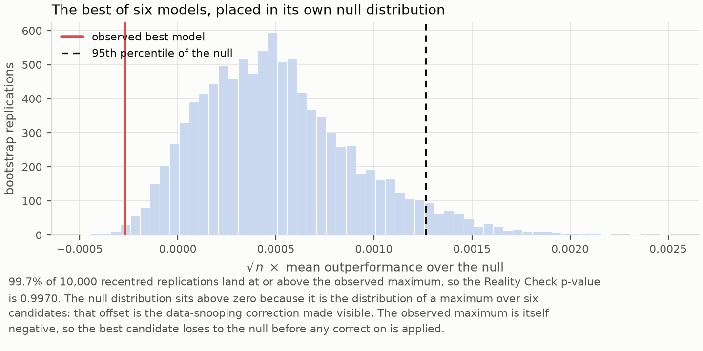

**Figure 5.** The best of six models placed inside its own bootstrap null distribution.

Figure 5 is the argument of Section 4.6 in one picture. The null distribution is centred *above* zero, because it is the distribution of a maximum over six candidates: that offset is the data-snooping correction made visible. The observed maximum is negative, so the best candidate loses to the null before any correction is applied. White's Reality Check gives p = 0.9970; Hansen's SPA gives $p = 0.6891$ under the consistent recentring, 0.6891 under the lower bound and 1.0000 under the upper bound. The joint null that no candidate beats the zero-return benchmark is nowhere near rejection.

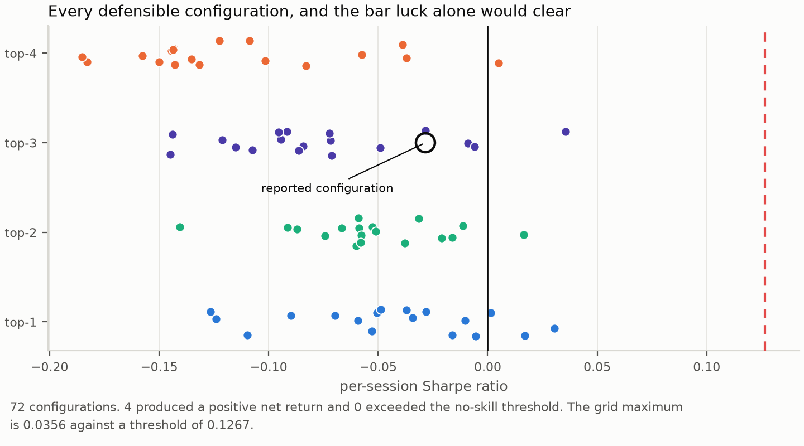

**Figure 6.** Every configuration in the 72-configuration grid, against the Sharpe ratio that skill-free search alone would be expected to produce.

The grid varies the minimum training window (24, 36, 48 dates), the validation width and step (5, 10, 20), the embargo (1, 2) and the portfolio breadth (1 to 4 names). Each point is a complete re-run of the evaluation. Only 5.56% of those configurations produced a positive net return. The reported configuration ranks 16th of 72 by Sharpe ratio, so it is neither cherry-picked nor unusually unlucky. The grid maximum reaches a per-session Sharpe ratio of 0.0356, against a threshold of 0.1267 that the best of 72 skill-free configurations would be expected to reach — the grid maximum does not even reach the bar that pure luck sets.

The single most compact statement of the result is this: across all 72 configurations, the zero-return null had the best out-of-sample R-squared in 72 of 72.

The deflated Sharpe ratio above rests on an assumption that Section 5.5 shows is both unnecessary and, as a test, invalid. Resampling all 72 configurations on a single stationary-bootstrap index draw replaces it with a measurement, and the co-movement it preserves is substantial: the mean pairwise correlation between configurations is 0.8395.

| Quantity | Value |
| --- | ---: |
| Configurations resampled jointly | 72 |
| Sessions common to every configuration | 87 |
| Mean pairwise correlation between configurations | 0.8395 |
| Best configuration | `train48_val20_step20_emb2_k2` |
| Its per-session Sharpe ratio | 0.0247 |
| Expected maximum under the joint null | 0.1049 |
| 95th percentile under the joint null | 0.2925 |
| **Exact bootstrap p-value** | **0.7715** |
| Independent-equivalent trials | 3.77 |

The grid behaves like 3.77 independent trials against a nominal 72. The closed-form route of Section 4.8 gives 7.01. Both are far below 72 and the conclusion does not turn on which is preferred, but the closed form errs towards claiming more independence than the grid has, and therefore towards a harsher correction than necessary — the direction one wants an error in a search correction to run.

### 6.4 Costs, not signal, decide the outcome

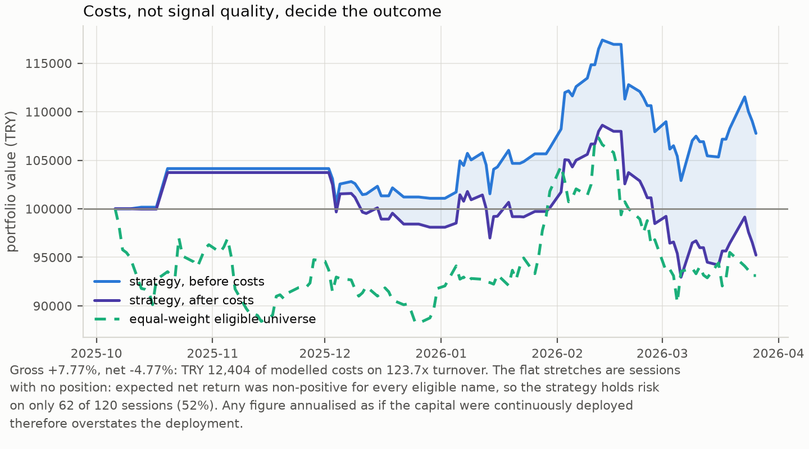

**Figure 7.** Gross and net equity against the equal-weight eligible universe.

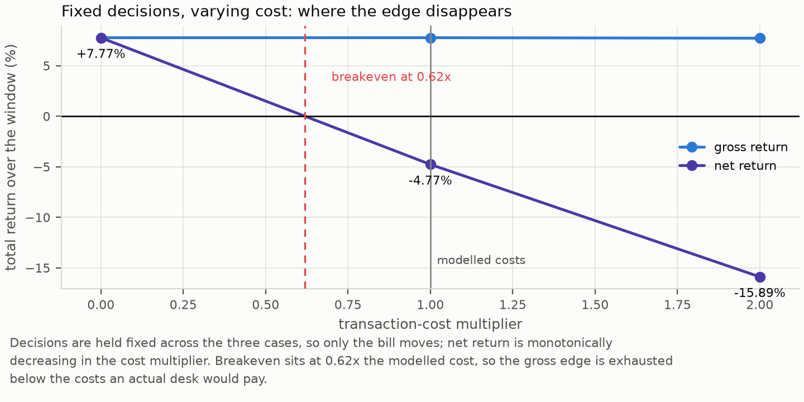

**Figure 8.** Fixed trading decisions under three cost multipliers.

The strategy earns a gross return of 7.77% and loses 4.77% of its capital after costs, on 123.7x turnover and TRY 12,404 of modelled cost, giving an annualised Sharpe ratio of -0.4513. Breakeven sits at 0.62x the modelled cost schedule, comfortably below what an actual desk would pay. This reproduces Novy-Marx and Velikov's finding [15] at small scale: the gross edge is real and the net edge is not.

Figure 7 also shows something the return statistics hide. The flat stretches are sessions in which no eligible name had a positive expected net return, so the strategy held nothing. It carries risk on only 62 of 120 sessions. Any figure annualised as though the capital were continuously deployed — including the annualised return and Sharpe ratio quoted below — therefore overstates the deployment, and is reported here only because it is the convention.

### 6.5 The conclusion does not depend on the arbitrary choices

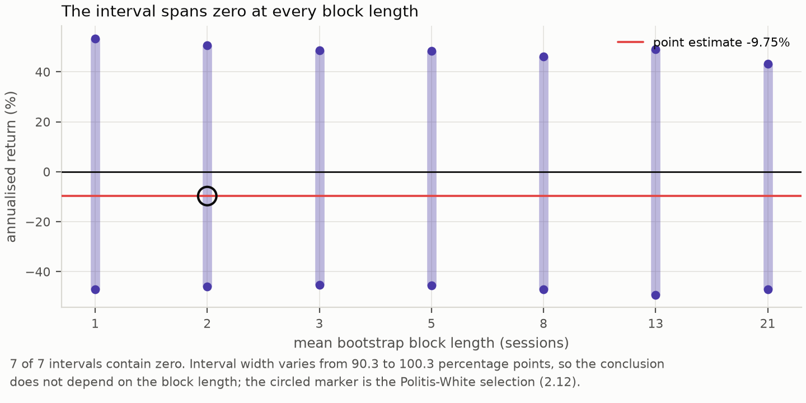

**Figure 9.** The 95% bootstrap interval for annualised return, repeated across seven block lengths.

A bootstrap block length is an arbitrary choice, so all seven are reported. Every interval contains zero and their widths vary by about ten percentage points out of ninety. The interval is a statement about the data, not about the block length.

### 6.6 The design was never powered for a plausible effect

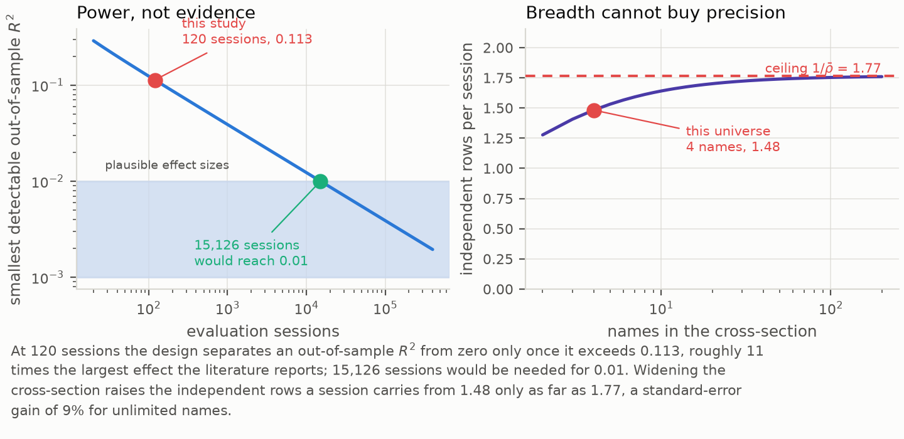

**Figure 10.** Left: the smallest out-of-sample R-squared separable from zero at 5% size and 80% power, against the number of evaluation sessions. Right: independent rows per session against the number of names, with the ceiling of Proposition 1.

At 120 sessions the best-powered candidate could have been separated from the null only by an out-of-sample R-squared above 0.1132. That is roughly eleven times the upper end of what [22] and [23] treat as economically meaningful, and about a hundred times the values those studies typically report. Detecting an out-of-sample R-squared of 0.01 at the same size and power would need 15,126 sessions of this panel: about sixty years of trading.

The portfolio side is worse. Establishing skill at the conventional deflated-Sharpe bar of 0.95 would have required a Sharpe ratio of 0.2884 per session, an annualised 4.5785. No equity strategy operates there. The correct reading of the deflated Sharpe ratio of 0.0452 is therefore not "the strategy has no skill" but "a 120-session record searched over 72 configurations cannot demonstrate skill at any plausible level, and this one does not come close either".

The right panel closes the obvious escape route. Proposition 1 caps the panel at 1.7663 independent rows per session; four names already reach 1.4823 of that. The ceiling is instantiated on the cross-sectional dependence of the loss differential (0.5662), which is what enters the standard error of the test, rather than on the dependence of the raw target (0.5697), which is what the panel diagnostic reports; the two are close here but they are different objects. An unlimited universe at the same correlation would improve standard errors by about 9%, which moves the detectable R-squared from 0.113 to roughly 0.095, not to 0.01. Breadth is not the missing ingredient. Sessions are.

### 6.7 The cost schedule rules the design out before any model is chosen

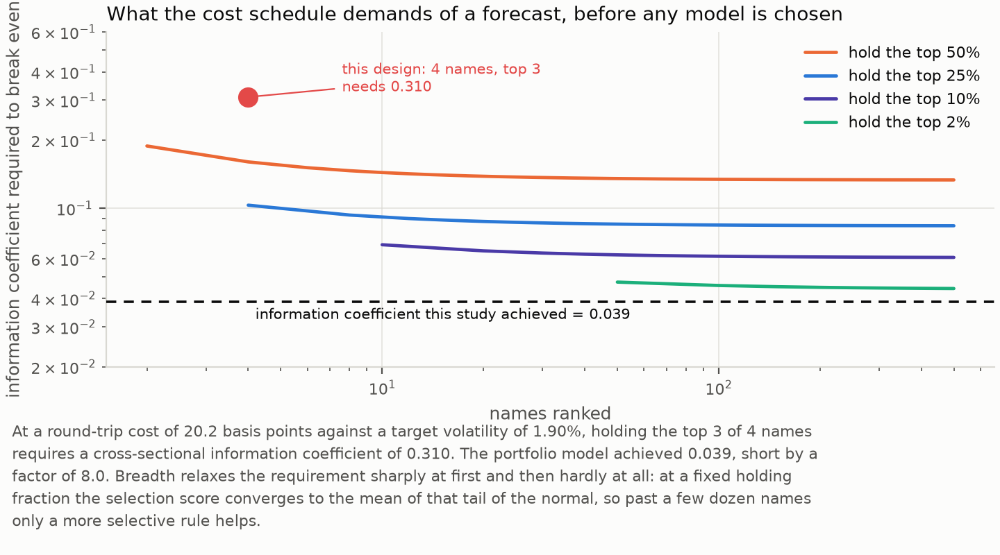

**Figure 11.** Proposition 2 evaluated across universe widths and holding fractions at this run's cost schedule, against the information coefficient the portfolio model achieved.

This is the sharpest result in the repository. At a round-trip cost of 20.2 basis points against a target standard deviation of 1.90%, holding the top 3 of 4 names — a selection score of only 0.3431, since holding three quarters of the universe barely selects at all — requires a cross-sectional information coefficient of 0.3098. The portfolio model achieved 0.0092 per session, with a standard error of 0.0549 -- indistinguishable from zero. The design demanded roughly thirty times the skill it got. Pooling the correlation over stock-sessions instead gives 0.0387, four times larger, because it also absorbs the common time-series component; that larger number is the one a study would quote if it did not distinguish the two, and it is not the quantity ranking uses.

Widening the universe helps, but how much depends on the regime, and an earlier version of this document got that wrong. At a fixed holding *fraction* the requirement converges: holding the top 2% of 500 names still needs about 0.043. At a fixed holding *count* it does not converge at all, so a sufficiently wide ranking always clears the bound eventually -- at a pooled correlation of 0.0387, ranking 256 names and holding one would already do it. Measured at the per-session IC of 0.0092 the universe required exceeds a million names, which is the honest form of the statement: not that breadth cannot help, but that no attainable market is wide enough at this level of skill, and that the one-name rule which gets closest is precisely the one capacity and market impact rule out.

Worth separating from the statistical result, because the two are independent: the tests in Section 6.3 say the forecast is not distinguishable from zero, while Proposition 2 says that even a forecast that *was* distinguishable — at an information coefficient of 0.05, say, which would be a respectable result in this literature — would still have lost money in this design. A study reporting such a forecast as a success, without evaluating the bound, would be reporting a statistically real and economically worthless effect.

### 6.8 Both readings of the search correction agree

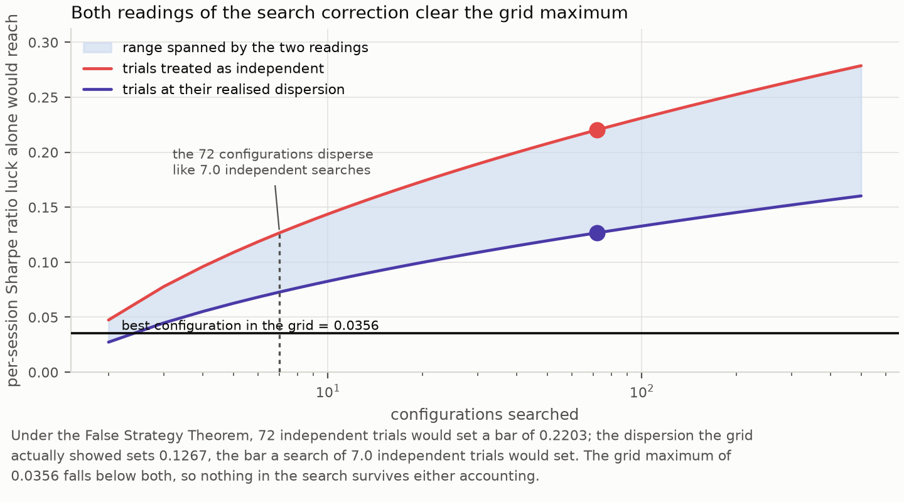

**Figure 12.** The False Strategy threshold against the number of configurations searched, under independent trials and at the dispersion the grid actually showed.

The 72 configurations disperse considerably less than 72 independent trials would: their realised Sharpe variance is 0.002757 against the 0.008337 a single 120-session estimate carries. That second number is a *sampling* variance and shrinks like $1/n$, so the threshold built from it falls like $n^{-1/2}$ as a record lengthens; the threshold is a permanent floor only if the variance fed to the theorem measures persistent heterogeneity in true Sharpe ratios, which the realised cross-trial variance does not cleanly do. Solving the equation in Proposition 3 shows the grid to behave like 7.01 independent searches. That is a useful diagnostic on its own — a search whose effective count is far below its nominal count is exploring one design repeatedly rather than exploring a design space.

For the conclusion it matters less than one might expect, which is why both are reported. Treating the trials as independent puts the bar at 0.2203; their realised dispersion puts it at 0.1267. The grid maximum is 0.0356, below both by a wide margin. Whatever one believes about how to count a correlated search, nothing in this grid survives it.

### 6.9 Committed run

The block below is generated from the immutable run artifacts by `bist_predict.research.readme_results`; `make verify-claims` regenerates it and fails if the document has drifted.

<!-- ACCEPTED_RESULTS:START -->
### Accepted run provenance

| Field | Value |
|---|---|
| Run | `20260810T230615Z-d346031-2a71b8` |
| Git commit | `d346031b4190` (clean working tree recorded) |
| Dataset | `fixed_bist_large_cap_prototype-150d24cf4251` |
| Scope | `fixed_bist_large_cap_prototype` |
| Tickers | GARAN, ISCTR, KCHOL, THYAO |
| Period | 2025-04-07 to 2026-04-03 |
| Provider rows | 1,004 |

### Out-of-sample prediction metrics

| Model | Samples | MAE | RMSE | Zero-mean R-squared | Spearman IC | Directional accuracy | Balanced accuracy |
|---|---:|---:|---:|---:|---:|---:|---:|
| logistic | 480 | 1.5019% | 1.9713% | -0.0783 | -0.0040 | 48.75% | 47.87% |
| majority_direction | 480 | 1.9780% | 2.4662% | -0.6876 | 0.1080 | 53.12% | 50.00% |
| market_direction | 480 | 1.8731% | 2.4583% | -0.6768 | 0.0094 | 52.71% | 52.35% |
| previous_return | 480 | 1.9837% | 2.6340% | -0.9252 | 0.0324 | 51.25% | 51.03% |
| ridge | 480 | 1.6515% | 2.1199% | -0.2470 | 0.0210 | 51.04% | 50.97% |
| rolling_mean | 480 | 1.4612% | 1.9619% | -0.0680 | 0.0079 | 50.42% | 50.01% |
| zero_return | 480 | 1.4248% | 1.8984% | 0.0000 | not available | 53.12% | 50.00% |

### Accepted portfolio result

| Portfolio measure | Accepted result |
|---|---:|
| Gross return | 7.7694% |
| Net return | -4.7687% |
| Annualized return | -9.7521% |
| Annualized volatility | 18.8297% |
| Sharpe | -0.4513 |
| Maximum drawdown | -14.4181% |
| Turnover | 123.6824x |
| Trade count | 143 |
| Equal-weight benchmark return | -5.8309% |
| Benchmark-relative return | 1.0621% |
| Total modeled costs | TRY 12,403.77 |

### Transaction-cost sensitivity

| Cost case | Gross return | Net return | Total costs | Trades |
|---|---:|---:|---:|---:|
| 0.0x | 7.7671% | 7.7671% | TRY 0.00 | 143 |
| 1.0x | 7.7694% | -4.7687% | TRY 12,403.77 | 143 |
| 2.0x | 7.7188% | -15.8890% | TRY 23,338.11 | 143 |

### Negative results and evidence limits

- No evaluated model achieved positive zero-mean R-squared; the best observed value was 0.0000 for `zero_return`.
- The 95% block-bootstrap interval for annualized return spans zero (-45.55% to 50.44%).
- No relevant BIST index benchmark was available in the accepted input dataset; the report therefore does not claim index-relative performance.
- Net return did not improve as modeled transaction costs increased (7.7671% to -15.8890%).
- Same-session rows correlate at 0.570, so the 480 out-of-sample rows carry about 177 independent observations, not 480.
- No model beats the zero-return null on squared error after Holm correction (0 of 6 favour the model); 4 models are significantly worse than it: `majority_direction`, `market_direction`, `previous_return`, `ridge`.
- Hansen's test of superior predictive ability does not reject the null that no candidate beats the zero-return benchmark (p = 0.6891, consistent recentring).
- The strategy's deflated Sharpe ratio is 0.0452 against a search threshold of 0.1267 per session across 72 configurations.
- Across the 72-configuration grid, 5.56% of configurations produced a positive net return, and the zero-return null had the best out-of-sample R-squared in 72 of 72.
<!-- ACCEPTED_RESULTS:END -->

### 6.10 Inference

<!-- INFERENCE:START -->
### Effective sample size

| Quantity | Value |
|---|---:|
| Panel units | 4 |
| Evaluated sessions | 120 |
| Out-of-sample rows | 480 |
| Mean within-session correlation | 0.5697 |
| Variance inflation factor | 2.7090 |
| Effective independent rows | 177.2 |

### Equal predictive accuracy against the zero-return null

Squared-error loss, Diebold-Mariano with the Harvey-Leybourne-Newbold
correction. The differential is `loss(model) - loss(null)`, so a positive
statistic means the model loses to the null.

| Model | DM statistic | p | Holm-adjusted p | Verdict | Row-level p |
|---|---:|---:|---:|---|---:|
| logistic | +1.945 | 0.0541 | 0.1081 | indistinguishable | 0.0015 |
| majority_direction | +5.334 | 0.0000 | 0.0000 | loses to the null | 0.0000 |
| market_direction | +3.824 | 0.0002 | 0.0008 | loses to the null | 0.0000 |
| previous_return | +4.707 | 0.0000 | 0.0000 | loses to the null | 0.0000 |
| ridge | +3.334 | 0.0011 | 0.0034 | loses to the null | 0.0000 |
| rolling_mean | +1.642 | 0.1031 | 0.1081 | indistinguishable | 0.0103 |

Holm rejects the null of equal accuracy for 4 of 6 models; 0 of those rejections favour the model.

### Data snooping across the model family

| Test | Statistic | p |
|---|---:|---:|
| White Reality Check | -0.000268 | 0.9970 |
| Hansen SPA (lower) | 0.0000 | 0.6891 |
| Hansen SPA (consistent) | 0.0000 | 0.6891 |
| Hansen SPA (upper) | 0.0000 | 1.0000 |

Best candidate by mean outperformance: `rolling_mean` at -2.450e-05 squared-error units, over 10,000 stationary-bootstrap replications with mean block length 12.26.

### Portfolio Sharpe ratio under search

| Quantity | Value |
|---|---:|
| Sessions | 120 |
| Per-session Sharpe | -0.0284 |
| Annualised Sharpe (square-root rule) | -0.4513 |
| Annualised Sharpe (Lo autocorrelation-adjusted) | -0.4973 |
| Skewness | -0.0722 |
| Kurtosis | 7.2290 |
| Probabilistic Sharpe ratio, threshold 0 | 0.3782 |
| Configurations examined | 72 |
| Search threshold (expected maximum under no skill) | 0.1267 |
| Deflated Sharpe ratio | 0.0452 |
<!-- INFERENCE:END -->

### 6.11 Sensitivity

<!-- SENSITIVITY:START -->
### Configuration grid

| Configuration | Net return | Per-session Sharpe | Sessions | Trades |
|---|---:|---:|---:|---:|
| Best: `train24_val5_step5_emb2_k3` | 4.6259% | 0.0356 | 125 | 155 |
| Reported: `train24_val10_step10_emb1_k3` | -4.7687% | -0.0284 | 120 | 143 |
| Worst: `train48_val10_step10_emb1_k4` | -20.9773% | -0.1852 | 100 | 202 |

| Grid summary | Value |
|---|---:|
| Configurations evaluated | 72 |
| Reported rank by Sharpe | 16 |
| Median per-session Sharpe | -0.0682 |
| Per-session Sharpe range | -0.1852 to 0.0356 |
| Configurations with positive net return | 5.56% |
| Configurations where the zero-return null had the best out-of-sample R-squared | 72 of 72 |
| Expected maximum Sharpe under no skill | 0.1267 |

### Bootstrap block-length sensitivity

| Mean block length | Annualised return 95% interval |
|---:|---|
| 1 | -47.01% to +53.29% |
| 2 | -46.03% to +50.55% |
| 3 | -45.41% to +48.56% |
| 5 | -45.60% to +48.28% |
| 8 | -47.09% to +46.13% |
| 13 | -49.26% to +48.93% |
| 21 | -47.01% to +43.24% |
<!-- SENSITIVITY:END -->

---

## 7. Discussion

On this universe, over this window, at this horizon, scale-normalised price and volume features carry no out-of-sample information about next-session open-to-close returns that survives an honest accounting of sample size, dependence, nesting and search. No forecast shows predictive content under the one test that is correctly sized for the comparison, the whole family is far from rejection jointly, and the best of 72 configurations sits at an exact joint p-value of 0.7715.

None of that means Borsa Istanbul is efficient, that no short-horizon signal exists, or that machine learning cannot forecast equity returns. It does not even mean this particular signal is absent. Sections 6.6 to 6.8 make the honest version of the claim available: an effect large enough to be *usable* at this horizon on this universe would have shown up and did not, while an effect of the size the literature actually reports would not have shown up either way, and the experiment is simply silent about it. That distinction is the difference between evidence and an uninformative experiment, and it is cheap to compute.

Two mechanisms in the results deserve explanation rather than surprise, and the first is a correction to what a reader would otherwise reasonably conclude. A model with no signal does not merely fail to help: it adds estimation variance to the forecast, and in a mean-squared-error comparison against a zero forecast that variance is a pure cost. It is tempting to read several fitted models landing below zero as a consistency check confirming they are worthless. It is not a check of anything — Section 5.3 shows the same pattern arises with probability 0.9219 when the models are exactly at the null, so the observation has no diagnostic value and must be replaced by the Clark-West test rather than interpreted. And the trivial baselines look competitive on direction only because 53.12% of realised targets are non-positive, so a constant "down" predictor achieves 53.12% directional accuracy while carrying no information at all. Directional accuracy without its base rate is not interpretable, which is why it is reported next to balanced accuracy and never used as a headline.

**The Sharpe ratio, read properly.** Session returns have a kurtosis of 7.2290, so the normal-theory
Sharpe interval understates tail risk. Accounting for the higher moments, the probability that the
true per-session Sharpe ratio exceeds zero is 0.3782 — already below even odds before any search
correction. Deflating by the 72 configurations examined leaves a deflated Sharpe ratio of 0.0452.
Lo's autocorrelation-aware annualisation gives -0.4973 against the square-root rule's -0.4513, so the
conventional rule is, if anything, flattering here.

The False Strategy threshold in Section 4.6 is an *expectation*, not a critical value: a genuinely skill-free grid clears it in 45.7% to 50.0% of replications regardless of how dependent the trials are (Section 5.5). The threshold is therefore reported as a diagnostic, and the test is either the deflated Sharpe ratio, which converts it into a probability under an independence assumption, or the joint bootstrap, which does not need one. All three are shown.

### What follows for the design of such studies

The checks in Sections 4.8 and 5 are cheap to compute and belong in the design phase rather than the post-mortem. Most can be evaluated before any data is modelled.

**Compute the size of your test before trusting its p-values.** The closed form in Section 5.2 needs two numbers a panel study already has: the width of the cross-section and the average correlation within it. This is the cheapest check here and the one with the largest consequences.

**Aggregate to the unit at which observations are independent, and say so.** The gap between the row-level and session-level p-values here is a median factor of 52, and Section 5.2 establishes which side of that gap is correct. A panel study that does not state its unit of inference has not reported its result.

**Do not compare a fitted model against a zero or mean benchmark under squared-error loss.** They are nested, and the comparison is decided by the fitted model's own variance. Use Clark-West, or change the null. If a study reports that its models are significantly worse than a naive benchmark, that finding is very likely an artefact and should not be interpreted at all.

**Compute the feasibility bound before choosing a model family.** It needs only the cost schedule, the target volatility and the intended breadth, and it is the difference between "our model was not good enough" and "no model would have been"; a study that clears the statistical bar but not the feasibility bound has found something true and useless, and should say so.

**Compute the detectable effect before running the experiment.** It needs only the target's variance and the intended sample size. A design whose detectable effect exceeds the plausible effect by an order of magnitude will produce an uninformative answer whichever way it comes out.

**Report the effective size of the search, and resample the grid rather than deflating it.** Here the effective count is between 3.77 and 7.01 against a nominal 72. A joint bootstrap costs one index draw per replication and returns a p-value instead of a comparison against an expectation.

### Verifying the evaluator, not only the model

An evaluation apparatus is software, and software with no adversarial test is software of unknown quality. `make mutation-check` reintroduces twenty real defects into the inference and reporting code one at a time — an autocovariance normalised by $n-k$ instead of $n$, a Holm correction without its running maximum, a Diebold-Mariano test aggregating rows instead of sessions, a deflated Sharpe ratio that ignores the trial count, a Clark-West adjustment missing its factor of two, a joint bootstrap that resamples each configuration separately, and fourteen others — and requires a named test to fail for each and to pass again once the edit is reverted. Four of the guarding tests turned out to be decorative and were repaired as a result: three when the catalogue was first written, and one when the joint search was added, where a skill-free grid could not detect a missing recentring because its means were already near zero. A negative result in particular has no external check, since nobody notices when a broken test fails to find an effect that is not there, so the apparatus has to be checked directly.

Mutation testing and simulation calibration answer different questions, and a serious pipeline needs both. Mutation testing asks whether the code implements the estimator its author intended; simulation calibration asks whether that estimator answers the question its user believes it answers. **Everything Section 5 found wrong was correctly implemented.** The Diebold-Mariano test computes the Diebold-Mariano statistic exactly as specified, on rows that are not independent, for models that are nested. No amount of testing against the specification would have found it, because the specification was not the problem.

---

## 8. Limitations

Stated plainly, including the ones that weaken the headline.

- **Sample.** Four stocks, 251 sessions, 120 evaluated. Too small for a strong economic conclusion, and the confidence intervals say so: the 95% interval for annualised return spans roughly −45% to +50%.
- **Universe.** A fixed prototype, not point-in-time BIST-100 membership. Free of survivorship bias within its own definition, but not representative of the index.
- **No index benchmark.** The committed input contains no BIST index series, so only cash and an equal-weight eligible-universe benchmark are reported. No index-relative claim is made.
- **No sector metadata.** Sector-relative features and sector attribution are unavailable and are reported as unavailable rather than filled with a placeholder.
- **Deployment.** The strategy holds risk on 62 of 120 sessions. Annualised figures assume continuous deployment and therefore overstate it.
- **One asset class, one horizon.** Nothing here transfers to other horizons or instruments without re-running the apparatus.
- **The search grid is itself a choice.** 72 configurations were swept; a different grid would give a different deflation threshold. The grid is declared in the run configuration so the choice is auditable, but it is a choice.
- **Corporate actions.** Transition and fail-closed policies are tested, but the committed empirical snapshot contains cash dividends only. Splits, rights issues and delistings are exercised by synthetic tests, not by this data.
- **The detectability bounds carry their own assumptions.** The panel ceiling uses an equicorrelated approximation of a matrix whose realised pairwise values range from 0.46 to 0.83, so it is an average-case statement. The feasibility bound assumes joint normality and an unbiased forecast and ignores estimation error in the ranking, all of which make it optimistic — a design that fails it fails a fortiori. The closed-form power calculation treats the loss-differential standard error as scaling exactly as $n^{-1/2}$, which is exact only if the higher moments of the differential are stable across window lengths; Section 5 supersedes it where the two overlap, and reports a *larger* minimum detectable effect (0.2012 against 0.1132), meaning the closed form is optimistic and the design was even less well powered than Section 6.6 states.
- **The calibration study has limits of its own.** Its panels are equicorrelated rather than factor-structured, its forecast families share one predictable component and differ only in noise, and its search experiment imposes exchangeable dependence between trials. Each simplification omits heterogeneity a real design has, and in each case the omission works in the direction of understating the measured error rate, so the numbers are lower bounds. The study also calibrates against panels matched to *this* panel; a study whose cross-sectional correlation or forecast variance ratio differs must re-run it at its own design point rather than citing these numbers.
- **Not evidence about the excluded components.** Kalman filters, Ornstein-Uhlenbeck mean reversion, GARCH, HMM regimes, wavelets, cointegration, Kelly sizing, gradient boosting, stacking, calibration, LSTM and Transformer models are all implemented and none is part of the accepted experiment. A passing construction test is not a research result, and their presence should not be read as evidence of predictive value.

---

## 9. Conclusion

The standard apparatus for comparing forecasts on an equity panel is miscalibrated in three places, and this work measured how badly. Applied to panel rows, the equal-accuracy test rejects a true null 22.84% of the time on four correlated names and 79.13% on a hundred, at a nominal 5%; the inflation has a closed form the simulation reproduces to within 0.0064 everywhere, and Holm's family-wise error rate follows it to 0.5875. Compared against a zero benchmark under squared-error loss, a forecast that is pure estimation noise is declared significantly worse than the benchmark in 92.19% of replications, rising to certainty as the record lengthens. The False Strategy Theorem's threshold is cleared by roughly half of all skill-free grids at every level of dependence between trials, because it is an expectation. Each failure has a replacement that holds its nominal level under heavy tails, clustered volatility, regime switches and record lengths from 60 to 500 sessions.

Applied to a leakage-controlled Borsa Istanbul panel with an executable target, the corrected apparatus returns a negative result — and a different one from what the uncorrected apparatus reports. No forecast shows predictive content; the joint data-snooping null is not rejected at any conventional level; the best of 72 configurations, which behave like fewer than four independent trials, has an exact joint p-value of 0.7715. The reported strategy loses money after costs, and would lose money at 0.62x the modelled cost schedule. What does *not* survive is the claim that four of the six models are significantly worse than the null: that is the nesting artefact, and a study reporting it as a finding would be reporting the output of its own estimation variance.

Inverting the corrected tests turns that from a verdict about the market into a verdict about the experiment. The design could only have resolved an out-of-sample R-squared above 0.113 in closed form and 0.2012 by simulation, against the 0.01 this literature treats as economically meaningful. Widening the cross-section cannot substitute, because a session of correlated names carries a bounded amount of independent information. And the cost schedule demanded an information coefficient of 0.3098 from a design whose portfolio model achieved 0.0092 per session — a bound no choice of model family could have met, and one that would have been known before the first model was fitted had it been computed.

The useful output is therefore the apparatus and its self-assessment: a target the backtest can trade, an evaluation whose unit of inference matches the data's dependence structure, tests whose measured size is reported alongside their nominal size, a search that is resampled rather than assumed, an explicit statement of what the design could and could not have found, and a run that replays byte-for-byte. Two next steps follow, and they are not the same step. For this market, a longer point-in-time dated universe and a cheaper execution assumption, chosen so that the feasibility bound is cleared before the first model is fitted — not another model family. For the literature, a calibration run at each study's own design point, which costs a few minutes of computation and is the difference between a p-value and a number that resembles one.

---

## Reproducing

Prerequisites: Python 3.12+, [uv](https://docs.astral.sh/uv/), and a Rust toolchain only if the optional indicator library is wanted.

```bash
git clone https://github.com/ITheClixs/Prediction-System-for-Istanbul-Stock-Exchange.git
cd Prediction-System-for-Istanbul-Stock-Exchange
uv sync
```

Replay the committed run and verify every scientific artifact hash. No network access is needed:

```bash
make reproduce-committed
```

Rebuild the simulation calibration of Section 5. It takes about four minutes, touches no market data, and writes a single artifact carrying a content hash over its own numbers:

```bash
uv run bist-predict calibrate
```

Regenerate the figures, the generated document blocks, and the claim check:

```bash
make calibrate
make figures        RUN_ID=20260810T230615Z-d346031-2a71b8
make readme-results RUN_ID=20260810T230615Z-d346031-2a71b8
make verify-claims  RUN_ID=20260810T230615Z-d346031-2a71b8
```

Build a new run from explicit, provenance-bearing inputs:

```bash
make benchmark \
  INPUT=runs/20260810T230615Z-d346031-2a71b8/input_prices.parquet \
  ACTIONS=runs/20260810T230615Z-d346031-2a71b8/corporate_actions.parquet \
  ACTION_COVERAGE=runs/20260810T230615Z-d346031-2a71b8/corporate_action_coverage.parquet
```

The optional Rust indicator library builds from inside its own crate directory, because `maturin` resolves the Python project from the working directory rather than from the manifest path:

```bash
cd rust/bist_features && uv run --project ../.. maturin develop --release
```

The accepted benchmark does not depend on it, and the tests that need it skip when it is absent.

### Verification

| Command | What it checks |
|---|---|
| `make test` | Full suite |
| `make research-invariants` | Leakage, chronology, schema identity, accounting |
| `make mutation-check` | Reintroduces 20 real defects and asserts the guarding test fails for each |
| `make calibrate` | Re-measures the size of every test in the stack against known truth |
| `make verify-claims RUN_ID=...` | Every number in this document and in the manuscript against the artifact that produced it |
| `make reproduce-committed` | Byte-identical replay of the committed run |
| `make lint format-check typecheck` | Ruff and mypy |
| `make coverage` | Coverage floor |

`make mutation-check` is the one worth running first. A test that passes on already-correct input proves nothing, so each guarded defect is reintroduced into the source and the guarding test is required to fail.

---

## Repository layout

```text
src/bist_predict/
  research/            accepted panel, folds, baselines, backtest, run artifacts
    inference/         HAC variance, Diebold-Mariano, Clark-West, Holm, Reality Check,
                       SPA, Sharpe, the joint search bootstrap, and the detectability,
                       feasibility and effective-trial bounds
    simulation/        synthetic panels with known truth, and the calibration study
                       that measures the size of every test above
    sensitivity.py     the configuration grid
    markdown_math.py   GitHub math-rendering rules
  figures/             every report figure, drawn from a run bundle
  paper/               manuscript tables and appendices, drawn from the same bundle
  ingest/              providers, reconciliation, calendar, corporate actions
  features/            manifests, lineage, preprocessing
  models/              experimental boosting and neural models
  quant/               experimental quantitative modules
tools/
  build_figures.py     figure builder
  build_paper.py       manuscript generator and typesetter
  verify_claims.py     document-to-artifact claim checker
  mutation_check.py    deliberate-defect harness
paper/                 the manuscript source and its rendered PDF
runs/                  immutable run bundles
calibration/           the simulation calibration study, with its own content hash
docs/figures/          generated figures, PNG and PDF
tests/                 methodology invariants and unit tests
```

---

## References

1. Diebold, F. X., and Mariano, R. S. (1995). Comparing predictive accuracy. *Journal of Business & Economic Statistics*, 13(3), 253–263. [doi:10.1080/07350015.1995.10524599](https://doi.org/10.1080/07350015.1995.10524599)
2. Harvey, D., Leybourne, S., and Newbold, P. (1997). Testing the equality of prediction mean squared errors. *International Journal of Forecasting*, 13(2), 281–291. [doi:10.1016/S0169-2070(96)00719-4](https://doi.org/10.1016/S0169-2070(96)00719-4)
3. Diebold, F. X. (2015). Comparing predictive accuracy, twenty years later. *Journal of Business & Economic Statistics*, 33(1), 1. [doi:10.1080/07350015.2014.983236](https://doi.org/10.1080/07350015.2014.983236)
4. White, H. (2000). A reality check for data snooping. *Econometrica*, 68(5), 1097–1126. [doi:10.1111/1468-0262.00152](https://doi.org/10.1111/1468-0262.00152)
5. Hansen, P. R. (2005). A test for superior predictive ability. *Journal of Business & Economic Statistics*, 23(4), 365–380. [doi:10.1198/073500105000000063](https://doi.org/10.1198/073500105000000063)
6. Sullivan, R., Timmermann, A., and White, H. (1999). Data-snooping, technical trading rule performance, and the bootstrap. *The Journal of Finance*, 54(5), 1647–1691. [doi:10.1111/0022-1082.00163](https://doi.org/10.1111/0022-1082.00163)
7. Politis, D. N., and Romano, J. P. (1994). The stationary bootstrap. *Journal of the American Statistical Association*, 89(428), 1303–1313. [doi:10.1080/01621459.1994.10476870](https://doi.org/10.1080/01621459.1994.10476870)
8. Politis, D. N., and White, H. (2004). Automatic block-length selection for the dependent bootstrap. *Econometric Reviews*, 23(1), 53–70. [doi:10.1081/ETC-120028836](https://doi.org/10.1081/ETC-120028836)
9. Patton, A., Politis, D. N., and White, H. (2009). Correction to "Automatic block-length selection for the dependent bootstrap". *Econometric Reviews*, 28(4), 372–375. [doi:10.1080/07474930802459016](https://doi.org/10.1080/07474930802459016)
10. Lo, A. W. (2002). The statistics of Sharpe ratios. *Financial Analysts Journal*, 58(4), 36–52. [doi:10.2469/faj.v58.n4.2453](https://doi.org/10.2469/faj.v58.n4.2453)
11. Bailey, D. H., and López de Prado, M. (2012). The Sharpe ratio efficient frontier. *Journal of Risk*, 15(2), 3–44. [doi:10.21314/JOR.2012.255](https://doi.org/10.21314/JOR.2012.255)
12. Bailey, D. H., and López de Prado, M. (2014). The deflated Sharpe ratio: correcting for selection bias, backtest overfitting, and non-normality. *Journal of Portfolio Management*, 40(5), 94–107. [doi:10.3905/jpm.2014.40.5.094](https://doi.org/10.3905/jpm.2014.40.5.094)
13. Bailey, D. H., Borwein, J. M., López de Prado, M., and Zhu, Q. J. (2014). Pseudo-mathematics and financial charlatanism: the effects of backtest overfitting on out-of-sample performance. *Notices of the American Mathematical Society*, 61(5), 458–471. [doi:10.1090/noti1105](https://doi.org/10.1090/noti1105)
14. Harvey, C. R., Liu, Y., and Zhu, H. (2016). … and the cross-section of expected returns. *Review of Financial Studies*, 29(1), 5–68. [doi:10.1093/rfs/hhv059](https://doi.org/10.1093/rfs/hhv059)
15. Novy-Marx, R., and Velikov, M. (2016). A taxonomy of anomalies and their trading costs. *Review of Financial Studies*, 29(1), 104–147. [doi:10.1093/rfs/hhv063](https://doi.org/10.1093/rfs/hhv063)
16. López de Prado, M. (2018). *Advances in Financial Machine Learning*. Wiley. ISBN 978-1-119-48208-6.
17. Kara, Y., Boyacıoğlu, M. A., and Baykan, Ö. K. (2011). Predicting direction of stock price index movement using artificial neural networks and support vector machines: the sample of the Istanbul Stock Exchange. *Expert Systems with Applications*, 38(5), 5311–5319. [doi:10.1016/j.eswa.2010.10.027](https://doi.org/10.1016/j.eswa.2010.10.027)
18. Holm, S. (1979). A simple sequentially rejective multiple test procedure. *Scandinavian Journal of Statistics*, 6(2), 65–70.
19. Newey, W. K., and West, K. D. (1987). A simple, positive semi-definite, heteroskedasticity and autocorrelation consistent covariance matrix. *Econometrica*, 55(3), 703–708. [doi:10.2307/1913610](https://doi.org/10.2307/1913610)
20. Newey, W. K., and West, K. D. (1994). Automatic lag selection in covariance matrix estimation. *Review of Economic Studies*, 61(4), 631–653. [doi:10.2307/2297912](https://doi.org/10.2307/2297912)
21. Welch, I., and Goyal, A. (2008). A comprehensive look at the empirical performance of equity premium prediction. *Review of Financial Studies*, 21(4), 1455–1508. [doi:10.1093/rfs/hhm014](https://doi.org/10.1093/rfs/hhm014)
22. Campbell, J. Y., and Thompson, S. B. (2008). Predicting excess stock returns out of sample: can anything beat the historical average? *Review of Financial Studies*, 21(4), 1509–1531. [doi:10.1093/rfs/hhm055](https://doi.org/10.1093/rfs/hhm055)
23. Gu, S., Kelly, B., and Xiu, D. (2020). Empirical asset pricing via machine learning. *Review of Financial Studies*, 33(5), 2223–2273. [doi:10.1093/rfs/hhaa009](https://doi.org/10.1093/rfs/hhaa009)
24. Cohen, J. (1988). *Statistical Power Analysis for the Behavioral Sciences*, 2nd ed. Lawrence Erlbaum Associates. ISBN 978-0-8058-0283-2.
25. Gelman, A., and Carlin, J. (2014). Beyond power calculations: assessing type S (sign) and type M (magnitude) errors. *Perspectives on Psychological Science*, 9(6), 641–651. [doi:10.1177/1745691614551642](https://doi.org/10.1177/1745691614551642)
26. Button, K. S., Ioannidis, J. P. A., Mokrysz, C., Nosek, B. A., Flint, J., Robinson, E. S. J., and Munafò, M. R. (2013). Power failure: why small sample size undermines the reliability of neuroscience. *Nature Reviews Neuroscience*, 14(5), 365–376. [doi:10.1038/nrn3475](https://doi.org/10.1038/nrn3475)
27. Ioannidis, J. P. A. (2005). Why most published research findings are false. *PLoS Medicine*, 2(8), e124. [doi:10.1371/journal.pmed.0020124](https://doi.org/10.1371/journal.pmed.0020124)
28. Grinold, R. C. (1989). The fundamental law of active management. *Journal of Portfolio Management*, 15(3), 30–37. [doi:10.3905/jpm.1989.409211](https://doi.org/10.3905/jpm.1989.409211)
29. David, H. A., and Nagaraja, H. N. (2003). *Order Statistics*, 3rd ed. Wiley. ISBN 978-0-471-38926-2.
30. Clark, T. E., and West, K. D. (2007). Approximately normal tests for equal predictive accuracy in nested models. *Journal of Econometrics*, 138(1), 291–311. [doi:10.1016/j.jeconom.2006.05.023](https://doi.org/10.1016/j.jeconom.2006.05.023)
31. Clark, T. E., and McCracken, M. W. (2001). Tests of equal forecast accuracy and encompassing for nested models. *Journal of Econometrics*, 105(1), 85–110. [doi:10.1016/S0304-4076(01)00071-9](https://doi.org/10.1016/S0304-4076(01)00071-9)
32. McCracken, M. W. (2007). Asymptotics for out of sample tests of Granger causality. *Journal of Econometrics*, 140(2), 719–752. [doi:10.1016/j.jeconom.2006.07.020](https://doi.org/10.1016/j.jeconom.2006.07.020)
33. Giacomini, R., and White, H. (2006). Tests of conditional predictive ability. *Econometrica*, 74(6), 1545–1578. [doi:10.1111/j.1468-0262.2006.00718.x](https://doi.org/10.1111/j.1468-0262.2006.00718.x)
34. Romano, J. P., and Wolf, M. (2005). Stepwise multiple testing as formalized data snooping. *Econometrica*, 73(4), 1237–1282. [doi:10.1111/j.1468-0262.2005.00615.x](https://doi.org/10.1111/j.1468-0262.2005.00615.x)
35. Hansen, P. R., Lunde, A., and Nason, J. M. (2011). The model confidence set. *Econometrica*, 79(2), 453–497. [doi:10.3982/ECTA5771](https://doi.org/10.3982/ECTA5771)
36. Petersen, M. A. (2009). Estimating standard errors in finance panel data sets: comparing approaches. *The Review of Financial Studies*, 22(1), 435–480. [doi:10.1093/rfs/hhn053](https://doi.org/10.1093/rfs/hhn053)
37. Thompson, S. B. (2011). Simple formulas for standard errors that cluster by both firm and time. *Journal of Financial Economics*, 99(1), 1–10. [doi:10.1016/j.jfineco.2010.08.016](https://doi.org/10.1016/j.jfineco.2010.08.016)
38. Fama, E. F., and MacBeth, J. D. (1973). Risk, return, and equilibrium: empirical tests. *Journal of Political Economy*, 81(3), 607–636. [doi:10.1086/260061](https://doi.org/10.1086/260061)
39. Cook, S. R., Gelman, A., and Rubin, D. B. (2006). Validation of software for Bayesian models using posterior quantiles. *Journal of Computational and Graphical Statistics*, 15(3), 675–692. [doi:10.1198/106186006X136976](https://doi.org/10.1198/106186006X136976)
40. Talts, S., Betancourt, M., Simpson, D., Vehtari, A., and Gelman, A. (2018). Validating Bayesian inference algorithms with simulation-based calibration. *arXiv:1804.06788*. [doi:10.48550/arXiv.1804.06788](https://doi.org/10.48550/arXiv.1804.06788)

---

## License and disclaimer

GNU General Public License v3.0.

For research and education. Not financial advice. Past performance does not guarantee future results. The authors accept no liability for losses incurred from using this software.
