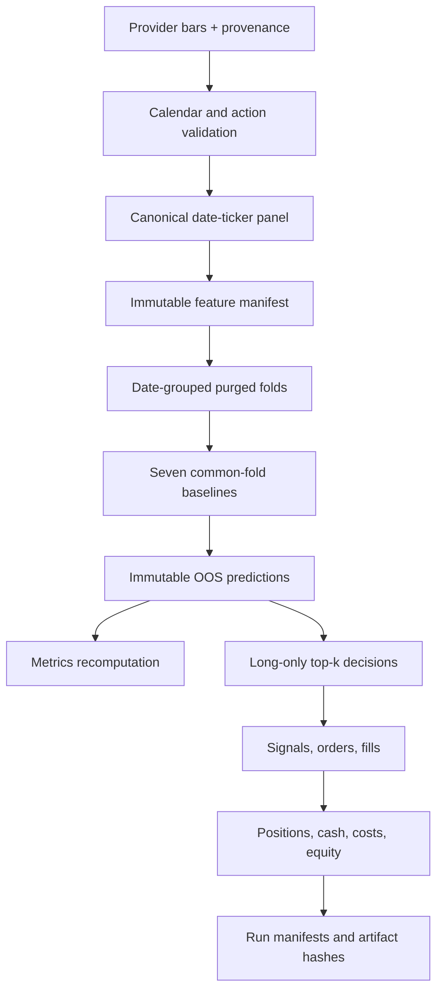

# BIST-Predict: A Leakage-Controlled BIST Equity Forecasting Benchmark

**Abstract.** BIST-Predict is a point-in-time equity-research benchmark for a fixed four-stock Borsa Istanbul prototype universe. The accepted path builds one canonical date-ticker panel, validates an immutable feature schema, creates an executable next-open-to-close target, evaluates seven baselines with date-grouped purged walk-forward folds, saves every out-of-sample prediction, and runs a transaction-cost-aware long-only portfolio simulation through explicit orders, fills, positions, cash, and cost ledgers. A committed provider-backed run is exactly reproducible from bundled inputs. Its results are negative: none of the fitted models beats the zero-return baseline on zero-mean out-of-sample $R^2$, and the selected ridge strategy loses money after costs. Those results are retained because methodological validity is the acceptance criterion; model novelty is not.

**Keywords:** Borsa Istanbul, point-in-time research, executable return targets, feature manifests, walk-forward validation, out-of-sample predictions, transaction costs, reproducibility.

> **Scope boundary.** This is not a historical BIST-100 study. The accepted experiment is named `fixed_bist_large_cap_prototype` and contains GARAN, ISCTR, KCHOL, and THYAO. See [`docs/component_status.yaml`](docs/component_status.yaml) for the machine-readable implementation and evidence boundary.

---

## Table of Contents

- [1. Research Problem](#1-research-problem)
- [2. System Architecture](#2-system-architecture)
- [3. Data and Storage Model](#3-data-and-storage-model)
- [4. Feature Construction](#4-feature-construction)
- [5. Experimental Quantitative Modules](#5-experimental-quantitative-modules)
- [6. Learning Algorithms](#6-learning-algorithms)
- [7. Calibration, Stacking, and Decision Rule](#7-calibration-stacking-and-decision-rule)
- [8. Evaluation Protocol](#8-evaluation-protocol)
- [9. Installation](#9-installation)
- [10. Quick Start](#10-quick-start)
- [11. CLI Commands](#11-cli-commands)
- [12. Configuration](#12-configuration)
- [13. Project Structure](#13-project-structure)
- [14. Testing](#14-testing)
- [15. Tech Stack and Data Sources](#15-tech-stack-and-data-sources)
- [16. Research Status and Limitations](#16-research-status-and-limitations)
- [17. License](#17-license)
- [18. Disclaimer](#18-disclaimer)

---

## 1. Research Problem

For ticker $i$ and feature date $t$, the accepted study uses only information available after the official close of session $t$. The signal is generated after that close, execution occurs at the observed open of the next session $t+1$, and the position is marked or exited at that session's official close:

$$
r_{i,t+1}^{\mathrm{exec}}
=
\frac{C_{i,t+1}^{\mathrm{raw}}}{O_{i,t+1}^{\mathrm{raw}}}-1,
\qquad
y_{i,t+1}=\mathbb{1}\!\left\{r_{i,t+1}^{\mathrm{exec}}>0\right\}.
$$

Every panel row stores `feature_available_at`, `signal_generated_at`, `execution_timestamp`, `target_start`, and `target_end`, and enforces

$$
\texttt{feature\_available\_at}
<
\texttt{execution\_timestamp}
\leq
\texttt{target\_start}
<
\texttt{target\_end}.
$$

This target is deliberately narrower than a generic next-day forecast: it is the return the backtest can actually earn under its stated timing. Internally, returns are decimal fractions; multiplication by 100 occurs only in reports.

The current research question is therefore:

> Do scale-normalized price and volume features provide out-of-sample information for next-session open-to-close returns in this fixed prototype, after chronological validation and explicit transaction costs?

---

## 2. System Architecture

The accepted path is intentionally small and evidence-driven.



### 2.1 Evidence Boundary

| Status | Components |
|---|---|
| Accepted and evaluated | Canonical panel, immutable feature manifest, stationary pooled features, official-calendar validation, executable target, date-grouped purged folds, seven baselines, saved OOS predictions, event-ledger backtest, immutable run replay. |
| Implemented but outside the accepted experiment | Bounded XGBoost/LightGBM search, strict chronological stacking and calibration, Rust indicators and benchmark, provider reconciliation. |
| Experimental legacy surface | Macro features, sentiment collection, Kalman/OU/GARCH/HMM/wavelet/cointegration features, LSTM, Transformer, model registry, legacy `train`, `signals`, `pipeline`, and `backtest` commands. |
| Not implemented | Point-in-time historical BIST-100 membership and sentiment scoring. |

Components outside the accepted path are never silently converted to zero-valued input columns. They remain available for research, but their existence is not presented as evidence of predictive value.

---

## 3. Data and Storage Model

### 3.1 Accepted Input Contract

The committed provider-backed run contains 1,004 rows for four tickers from 2025-04-07 through 2026-04-03. Every execution open and volume observation is marked `observed`; proxy opens are rejected.

The canonical provider record distinguishes:

| Representation | Research use |
|---|---|
| Raw tradable OHLCV | Orders, fills, and portfolio marking. |
| Split-adjusted OHLCV | Stationary technical features where continuity is required. |
| Total-return prices | Economic labels where distributions must be recognized. |
| Corporate-action events | Splits, bonus issues, rights issues, cash dividends, ticker changes, and delistings where sourced. |

Each row retains provider name, provider symbol, source record identifier, retrieval time, `open_quality`, and `volume_quality`. The Is Yatirim weighted-average price is represented as a proxy and cannot enter next-open execution research. Partial provider gaps can be repaired by the reconciliation layer; the accepted run itself uses one explicit Yahoo input snapshot rather than claiming an empirically validated multi-provider merge.

### 3.2 Calendar and Corporate Actions

The accepted runner validates expected sessions, duplicates, weekend rows, holidays, timezone, and full-day or half-day open/close timestamps against the committed Borsa Istanbul schedule. Its input bundle includes five sourced cash-dividend events and a per-ticker corporate-action query-coverage artifact.

Typed policies and invariant tests cover stock splits, bonus issues, rights issues, cash dividends, ticker changes, and delistings. Unsupported rights-action pricing fails closed. A synthetic two-for-one split verifies that a nominal price change from 100 to 50 does not become a false $-50\%$ economic return.

### 3.3 Immutable Run Bundle

Every accepted run is written under `runs/<run_id>/` and includes:

```text
config.yaml                 run_manifest.json
data_manifest.json          universe_manifest.json
feature_manifest.json       folds.json
trials.jsonl                predictions.parquet
metrics.json                model_artifact.json
environment.json            artifact_hashes.json
input_prices.parquet        official_calendar.parquet
corporate_actions.parquet   corporate_action_coverage.parquet
panel.parquet               sample_metadata.parquet
signals.parquet             orders.parquet
fills.parquet               positions.parquet
cash_ledger.parquet         costs.parquet
daily_equity.parquet
```

Run identifiers combine a UTC timestamp, short Git SHA, and configuration hash. Replay rebuilds the run from bundled inputs and checks every artifact hash.

---

## 4. Feature Construction

The accepted pooled model uses a typed `FeatureManifest` with schema version, ordered names, formulas and formula versions, lookbacks, availability rules, missing-value policies, normalization policies, and a content hash. Training and inference reject missing features, unknown features, changed order, and hash mismatches. Equal column count is not schema compatibility.

### 4.1 Accepted Feature Families

| Family | Accepted features |
|---|---|
| Returns | `log_return_1d`, `log_return_5d`, `log_return_20d` |
| Trend and volatility | `close_over_sma20_minus_1`, `sma20_over_sma100_minus_1`, `atr14_over_close`, `realized_volatility_20`, `drawdown_20` |
| Intraday and volume | `vwap20_over_close_minus_1`, `log_volume`, `volume_zscore_20`, `intraday_range_over_close`, `overnight_gap` |
| Cross-sectional context | `cross_sectional_return_rank`, `market_relative_return_20d` |
| Calendar encoding | `day_of_week_sin/cos`, `month_sin/cos` |

Raw close, moving-average levels, absolute ATR, raw VWAP, raw volume, and OBV are excluded from the pooled accepted feature set because nominal scale can act as accidental ticker identification.

### 4.2 Availability and Missingness

Feature generation retrieves the maximum configured lookback plus the target horizon and fails when there is insufficient history. Every enabled feature must become observable on at least one eligible sample.

Missing values retain an explicit reason:

```text
missing observation | insufficient lookback | calculation failure
not applicable | stale source
```

Economic zeros remain zeros. Tree estimators may retain native missing values; logistic and ridge models fit imputation and scaling on the training partition only. Missingness reports are grouped by feature, ticker, date, source, and fold. Future-perturbation and preprocessor-isolation tests guard the point-in-time boundary.

### 4.3 Feature Lineage

Generated feature artifacts record the feature-manifest hash, Git commit, input-data-manifest hash, calculation timestamp, code version, ticker, and date range. Existing versions are content-addressed rather than overwritten in place.

---

## 5. Experimental Quantitative Modules

The repository contains implementations of Kalman trend filters, Ornstein-Uhlenbeck mean reversion, GARCH volatility, HMM regimes, momentum and factor features, wavelets, cointegration, Kelly sizing, and other risk utilities. These modules are not part of the accepted benchmark because no common-fold experiment has established incremental value.

| Family | Implemented | Accepted feature input | Empirically accepted |
|---|---:|---:|---:|
| Kalman, OU, GARCH, HMM | Partial/yes | No | No |
| Wavelets and cointegration | Yes | No | No |
| Macro features | Partial | No | No |
| Sentiment collection | Partial | No | No |
| Sentiment scoring | No | No | No |
| Kelly sizing | Yes | No | No |

This boundary is intentional: a formula or passing construction test does not establish a research result.

---

## 6. Learning Algorithms

### 6.1 Accepted Baselines

All accepted models use the same panel, target, folds, feature manifest, evaluation dates, and train-only preprocessing.

| Baseline | Role |
|---|---|
| Zero return | Regression null and zero-mean $R^2$ reference. |
| Majority direction | Training-fold class-frequency null. |
| Previous return | One-session persistence heuristic. |
| Market direction | Same-date cross-sectional context baseline. |
| Rolling mean | Training-history return estimate. |
| Logistic regression | Regularized linear direction model. |
| Ridge regression | Regularized linear return model and accepted portfolio ranking model. |

Every OOS row records date, ticker, fold ID, model name/version, training end, feature-manifest hash, target, prediction, predicted probability, and predicted return. Metrics are recomputed from this file rather than copied from training logs.

### 6.2 Nonlinear and Neural Models

XGBoost and LightGBM have bounded search utilities with validation-based early stopping, best-iteration recording, declared trials, multiple seeds, and immutable trial manifests. They are not included in the accepted provider-backed result.

The LSTM and Transformer implementations remain experimental. They are disabled in the accepted pipeline until sequence alignment, training-only scaling, checkpoint restoration, deterministic validation, and common-fold incremental value are all demonstrated. Their presence does not make the benchmark more credible than the baselines.

---

## 7. Calibration, Stacking, and Decision Rule

Strict chronological stacking and calibration are implemented and invariant-tested, but they are outside the accepted provider-backed run.

For a stacker row, the repository persists row ID, base model, base-model training end, OOF fold ID, and prediction timestamp. A base model cannot generate a meta-feature for a row it trained on. Calibration uses a later, separate interval and reports Brier score, log loss, expected calibration error, slope, intercept, and reliability buckets on a final test block.

Raw model scores are not called confidence. The accepted portfolio decision is based on predicted net return after the declared decision-cost assumption:

$$
\hat r^{\mathrm{net}}_{i,t+1}
=
\hat r_{i,t+1}
-
\widehat{\mathrm{cost}}_{i,t+1}.
$$

On each signal date, eligible stocks with positive expected net return are ranked; at most the top $k=3$ receive equal long-only weights. The legacy `BUY`/`SELL` probability tiers and their arbitrary thresholds are not accepted research decisions.

---

## 8. Evaluation Protocol

### 8.1 Date-Grouped Walk-Forward Validation

Folds are expanding windows over unique trading dates, never row offsets. All tickers on one date remain in the same partition. The committed run uses 24 minimum training dates, 10 validation dates, a 10-date step, one embargo date, and 12 folds.

For every fold $k$:

$$
\max(\text{train target end})
<
\min(\text{validation feature time}).
$$

Invariant tests additionally prove that ticker ordering and row ordering cannot change fold membership, dates cannot appear in both partitions, all tickers share date boundaries, future raw-data changes cannot alter past features, and validation extremes cannot change training preprocessors.

### 8.2 Portfolio Simulation

The initial strategy is intentionally simple: long-only, top-$k$ predicted returns, equal weighting, next-open observed-price execution, and a one-session holding period. Its event sequence is:

1. Persist after-close predictions.
2. Apply universe and eligibility rules.
3. Convert positive expected net returns to target weights.
4. Submit next-open orders.
5. Reject unavailable or proxy opens.
6. Apply participation and liquidity limits.
7. Calculate fills.
8. Apply commission, spread, slippage, impact, and configured taxes.
9. Update positions and cash without allowing negative cash.
10. Mark the portfolio at the official close.
11. Process corporate actions under the declared entitlement policy.
12. Persist the complete ledger.

Accounting enforces

$$
E_T
=
E_0 + \mathrm{gross\ PnL} + \mathrm{distributions} - \mathrm{transaction\ costs}.
$$

The same signal decisions are reused across cost sensitivity cases. Increasing costs cannot improve net performance, and a no-position strategy has zero gross return, turnover, cost, and net return.

### 8.3 Metrics

Prediction reports include MAE, RMSE, zero-mean $R^2$, Pearson and Spearman IC, directional and balanced accuracy, log loss, Brier score, PR-AUC, and MCC. Portfolio reports include gross/net/annualized return, volatility, Sharpe, Sortino, maximum drawdown, Calmar, turnover, trade count, hit rate, holding period, exposures, concentration, cost decomposition, benchmark-relative return, information ratio, and seeded block-bootstrap intervals.

Prediction results are grouped by fold, year, ticker, liquidity bucket, and market regime. Sector slices are explicitly unavailable because the accepted input contains no sourced sector taxonomy. Portfolio-level sector, liquidity, and regime attribution is not implemented and is not claimed.

### 8.4 Committed Experiment

The following block is generated from the immutable run artifacts by `bist_predict.research.readme_results`.

<!-- ACCEPTED_RESULTS:START -->
### Accepted run provenance

| Field | Value |
|---|---|
| Run | `20260714T143541Z-112a94e-9d9b70` |
| Git commit | `112a94e174ca` (clean working tree recorded) |
| Dataset | `fixed_bist_large_cap_prototype-150d24cf4251` |
| Scope | `fixed_bist_large_cap_prototype` |
| Tickers | GARAN, ISCTR, KCHOL, THYAO |
| Period | 2025-04-07 to 2026-04-03 |
| Provider rows | 1,004 |

### Out-of-sample prediction metrics

| Model | Samples | MAE | RMSE | Zero-mean R-squared | Spearman IC | Directional accuracy | Balanced accuracy |
|---|---:|---:|---:|---:|---:|---:|---:|
| logistic | 480 | 1.5019% | 1.9713% | -0.0783 | -0.0040 | 48.75% | 47.87% |
| majority_direction | 480 | 1.9780% | 2.4662% | -0.6876 | 0.1080 | 53.12% | 50.00% |
| market_direction | 480 | 1.8731% | 2.4583% | -0.6768 | 0.0094 | 52.71% | 52.35% |
| previous_return | 480 | 1.9837% | 2.6340% | -0.9252 | 0.0324 | 51.25% | 51.03% |
| ridge | 480 | 1.6515% | 2.1199% | -0.2470 | 0.0210 | 51.04% | 50.97% |
| rolling_mean | 480 | 1.4612% | 1.9619% | -0.0680 | 0.0079 | 50.42% | 50.01% |
| zero_return | 480 | 1.4248% | 1.8984% | 0.0000 | not available | 53.12% | 50.00% |

### Accepted portfolio result

| Portfolio measure | Accepted result |
|---|---:|
| Gross return | -0.9636% |
| Net return | -6.3488% |
| Annualized return | -12.8679% |
| Annualized volatility | 11.8169% |
| Sharpe | -1.1067 |
| Maximum drawdown | -8.5707% |
| Turnover | 55.8212x |
| Trade count | 57 |
| Equal-weight benchmark return | -5.8309% |
| Benchmark-relative return | -0.5179% |
| Total modeled costs | TRY 5,494.49 |

### Transaction-cost sensitivity

| Cost case | Gross return | Net return | Total costs | Trades |
|---|---:|---:|---:|---:|
| 0.0x | -0.9545% | -0.9545% | TRY 0.00 | 57 |
| 1.0x | -0.9636% | -6.3488% | TRY 5,494.49 | 57 |
| 2.0x | -0.9579% | -11.4348% | TRY 10,688.12 | 57 |

### Negative results and evidence limits

- No evaluated model achieved positive zero-mean R-squared; the best observed value was 0.0000 for `zero_return`.
- The 95% block-bootstrap interval for annualized return spans zero (-34.22% to 11.12%).
- No relevant BIST index benchmark was available in the accepted input dataset; the report therefore does not claim index-relative performance.
- Net return did not improve as modeled transaction costs increased (-0.9545% to -11.4348%).
<!-- ACCEPTED_RESULTS:END -->

### 8.5 Methods-to-Code Traceability

| Method | Implementation | Invariant test | Artifact |
|---|---|---|---|
| Fixed experiment scope | `research/accepted_benchmark.py` | accepted benchmark E2E | `universe_manifest.json` |
| Official sessions | `ingest/calendar.py` | calendar validity | `official_calendar.parquet` |
| Corporate actions | `ingest/corporate_actions.py` | action and split invariants | `corporate_actions.parquet` |
| Canonical panel and target | `research/panel.py` | chronology and alignment | `panel.parquet` |
| Immutable feature identity | `features/manifest.py` | schema identity | `feature_manifest.json` |
| Date-grouped purged CV | `research/splits.py` | ordering invariance and purge | `folds.json` |
| Common-fold baselines | `research/baselines.py` | preprocessing isolation | `predictions.parquet` |
| Event-ledger backtest | `research/portfolio_backtest.py` | accounting and cost monotonicity | `fills.parquet`, `cash_ledger.parquet` |
| Immutable replay | `research/run_artifacts.py` | artifact round trip and exact replay | `artifact_hashes.json` |
| Prediction maturation | `research/prediction_tracking.py` | create-only lifecycle | frozen outcome store |

---

## 9. Installation

### Prerequisites

- Python 3.12+
- [uv](https://docs.astral.sh/uv/)
- Rust toolchain only for the optional Rust indicator library
- Homebrew `libomp` on macOS when running XGBoost

### Install

```bash
git clone <repo-url>
cd BIST-Predictorcl
uv sync
```

Optional Rust build:

```bash
uv run maturin develop --release --manifest-path rust/bist_features/Cargo.toml
```

There is no Python numerical fallback for the Rust indicator family. If the extension is unavailable, those indicators are explicitly disabled. The accepted benchmark does not depend on them.

---

## 10. Quick Start

Run the deterministic synthetic methodology check:

```bash
make reproduce-smoke
```

Exactly replay the committed provider-backed experiment:

```bash
make reproduce RUN_ID=20260714T143541Z-112a94e-9d9b70
```

Run a new accepted benchmark from explicit, provenance-bearing inputs:

```bash
make benchmark \
  INPUT=data/accepted/fixed_bist_large_cap_prices.parquet \
  ACTIONS=data/accepted/corporate_actions.parquet \
  ACTION_COVERAGE=data/accepted/corporate_action_coverage.parquet
```

No network access is required to replay the committed run.

---

## 11. CLI Commands

### 11.1 Accepted Commands

| Command | Purpose |
|---|---|
| `bist-predict benchmark` | Build a new accepted run from explicit price, action, and action-coverage inputs. |
| `bist-predict reproduce-smoke` | Run the bounded synthetic end-to-end methodology check. |
| `bist-predict reproduce <run-id>` | Rebuild a committed run and verify exact hashes. |
| `bist-predict mature-predictions` | Freeze realized outcomes after the exact target interval completes. |
| `bist-predict accuracy` | Report accuracy only from immutable signal-time records and frozen outcomes. |

Prediction lifecycle example:

```bash
uv run bist-predict mature-predictions \
  --store prediction_tracking \
  --prices data/accepted/fixed_bist_large_cap_prices.parquet \
  --as-of 2026-04-03T18:10:00+03:00

uv run bist-predict accuracy --store prediction_tracking
```

Historical predictions are never reevaluated with a newly retrained model.

### 11.2 Experimental Legacy Commands

`fetch`, `features`, `train`, `signals`, `pipeline`, and `backtest` operate the earlier SQLite/model-registry prototype. Their help text marks model-training, signal, pipeline, and backtest commands as experimental. They are retained for development and are not evidence for the accepted benchmark.

No illustrative `BUY`, `SELL`, or confidence output is shown here because no such output belongs to the committed accepted run.

---

## 12. Configuration

The accepted run stores its exact configuration in `runs/<run_id>/config.yaml`. The committed experiment uses:

```yaml
experiment_scope: fixed_bist_large_cap_prototype
methodology_version: accepted-baseline-v1
min_train_dates: 24
validation_dates: 10
step_dates: 10
embargo_dates: 1
portfolio_model: ridge
top_k: 3
starting_equity: 100000.0
commission_rate: 0.0002
bid_ask_spread_rate: 0.001
slippage_rate: 0.0003
market_impact_coefficient: 0.0001
max_participation: 0.01
seed: 42
```

The configuration hash is part of the run ID and manifest. Legacy `config.toml` options do not alter replayed run artifacts.

---

## 13. Project Structure

```text
BIST-Predictorcl/
+-- README.md
+-- Makefile
+-- pyproject.toml
+-- config.example.toml
+-- docs/component_status.yaml
+-- data/accepted/                  # committed provider/action snapshots
+-- runs/                           # immutable accepted run bundles
+-- benchmarks/results/             # Rust benchmark evidence
+-- .github/workflows/              # PR and scheduled research checks
+-- src/bist_predict/
|   +-- cli.py
|   +-- ingest/                     # providers, reconciliation, calendar, actions
|   +-- features/                   # manifests, lineage, preprocessing, legacy engine
|   +-- research/                   # accepted panel, folds, baselines, artifacts, backtest
|   +-- models/                     # experimental boosting/neural/ensemble models
|   +-- quant/                      # experimental quantitative modules
|   +-- evaluation/                 # legacy evaluation compatibility
|   +-- storage/                    # legacy SQLite surface
+-- rust/bist_features/             # optional PyO3 indicator library
+-- tests/
    +-- test_research/              # methodology and E2E invariants
    +-- test_ingest/                # provider, calendar, action invariants
    +-- test_features/              # schema, lineage, Rust equivalence
    +-- test_models/                # experimental model behavior
    +-- test_evaluation/
    +-- test_storage/
```

---

## 14. Testing

The repository does not use raw test count as research evidence. The important distinction is between ordinary construction tests and methodology invariants.

```bash
make lint
make format-check
make typecheck
make test
make coverage
make research-invariants
make rust-test
make rust-equivalence
make reproduce-smoke
make reproduce RUN_ID=20260714T143541Z-112a94e-9d9b70
```

The invariant suite covers:

| Boundary | Evidence |
|---|---|
| Schema identity | Equal-width but differently named/ordered matrices are rejected. |
| Global chronology | Date grouping, target purge, embargo, and ordering invariance. |
| Point-in-time features | Future perturbation and train-only preprocessor isolation. |
| Executable target | Availability, signal, open execution, and close target timestamps. |
| Market data | Calendar, provider reconciliation, quality flags, provenance, and action policies. |
| OOF learning | Base-model training rows cannot become their own stacker inputs. |
| Calibration | Fit and final-test intervals are chronologically separate. |
| Portfolio | Accounting identity, nonnegative cash, no-position neutrality, fixed-decision cost monotonicity. |
| Governance | Parquet/JSON round trips, metric recomputation, immutable tracking, exact artifact replay. |

Pull-request CI runs lint, formatting, type checking, coverage, research invariants, a deterministic synthetic pipeline, Rust tests, and Python-Rust equivalence. Scheduled CI adds live provider-schema and fresh-data smoke checks; those checks monitor interfaces and are not benchmark results.

---

## 15. Tech Stack and Data Sources

### 15.1 Tech Stack

| Function | Technology |
|---|---|
| Core research | Python 3.12+, pandas, NumPy, PyArrow, scikit-learn |
| CLI and environment | Click, uv |
| Optional nonlinear models | XGBoost, LightGBM |
| Experimental neural models | PyTorch |
| Experimental quantitative modules | SciPy, statsmodels, `arch`, hmmlearn, PyWavelets |
| Optional indicators | Rust, PyO3, maturin |
| Validation | pytest, coverage, ruff, mypy, pre-commit, Cargo |

### 15.2 Data Sources

| Source | Accepted use |
|---|---|
| Yahoo Finance chart endpoint | Committed four-ticker OHLCV and corporate-action snapshot with record-level provenance. |
| Borsa Istanbul official holidays | Expected sessions and full-day/half-day timestamps. |
| Is Yatirim | Legacy collection and tested proxy-quality handling; not accepted for next-open execution. |
| TCMB EVDS | Experimental macro collection; excluded without release-availability timestamps. |
| News/RSS feeds | Experimental headline collection; excluded because scoring and cutoff validation are incomplete. |

Free public sources can change availability or schema. Committed inputs and hashes isolate reproducibility from those future changes.

---

## 16. Research Status and Limitations

The accepted provider-backed experiment proves that the methodology executes and reproduces; it does not prove that the strategy has alpha.

- The universe is a fixed four-stock prototype, not historical BIST-100 membership.
- The sample is approximately one year and is too small for a strong economic conclusion.
- The relevant BIST index is unavailable in the committed input, so only cash and equal-weight eligible-universe benchmarks are reported.
- Sector metadata is unavailable; sector-relative features and sector reporting are excluded.
- The chosen ridge strategy is net negative, and its bootstrap interval includes both losses and gains.
- No accepted model achieves positive zero-mean OOS $R^2$.
- Advanced models, stacking, calibration, macro, sentiment, regimes, wavelets, cointegration, Kelly sizing, and neural networks remain outside the accepted experiment.
- Corporate-action tests cover all declared event types, while the committed empirical snapshot contains cash dividends only.
- Provider reconciliation is implemented and tested, but the accepted artifact is not evidence of a live multi-provider study.
- Live prediction persistence and maturation are executable, but no unattended production inference service is claimed.

The next legitimate research step is better point-in-time data and a longer dated universe—not another model family.

---

## 17. License

GNU General Public License v3.0

---

## 18. Disclaimer

This software is for educational and research purposes only. It is not financial advice. Past performance does not guarantee future results. The authors assume no liability for losses incurred from using this system.
